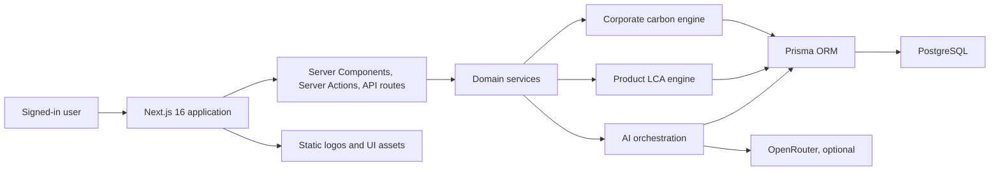
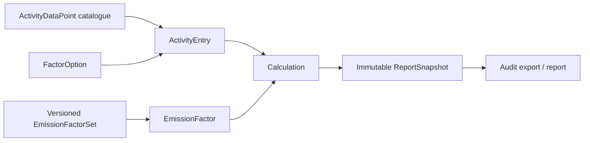

# Carbon Accounting Platform — Current-State Architecture

**Assessment date:** 10 August 2026  
**Source inspected:** `Carbon-Accounting-claude-paragon-id-uk-carbon-mvp-1h1uvb.zip`  
**Inspection basis:** static code, schema, migrations, tests, configuration, routes, and repository documentation. The archive was inspected as read-only source material. No database was connected, no seed was run, and no environmental data was ingested.

## 1. Executive assessment

The archive is not a thin MVP. It is a sizeable, server-rendered Next.js application containing three established capabilities:

1. a corporate Scope 1/2 and partial Scope 3 inventory;
2. a deliberately separate product LCA / product-carbon-footprint system; and
3. a provider-isolated AI assistance layer that cannot authoritatively calculate emissions or silently commit accounting data.

The application has strong foundations for auditability: versioned factor sets, factor snapshots on calculations, immutable report snapshots, append-only LCA calculation runs, issued LCA versions, evidence hashing, validation, and explicit human approval points.

Its main architectural limitation is tenancy. `Entity` currently represents one of the operating companies within a single consolidated group, not a SaaS customer. Users have one global role, users are not members of an organisation, and many reads are intentionally group-wide. Adding a second customer to the current schema would expose data across customers. Tenant isolation and configurable permissions are therefore the first expansion milestone, before EMS records or customer onboarding.

## 2. System context



This is a modular monolith: one application deployable, one PostgreSQL database, one Prisma schema, and domain services beneath a Next.js App Router UI. That is a sensible shape to preserve. The EMS should be added as another bounded domain in the monolith, with shared organisation, identity, permissions, documents, tasks, and audit services.

## 3. Technology baseline

| Concern | Current implementation | Assessment |
|---|---|---|
| Web | Next.js 16.3, React 19, TypeScript, App Router | Current, cohesive server-first architecture |
| UI | Tailwind CSS 4 and local UI primitives | Small dependency surface; reusable for EMS |
| Database | Generic PostgreSQL | Compatible with Neon but not yet Neon-configured |
| ORM | Prisma 6.19 | Strong typed schema and four ordered migrations |
| Authentication | NextAuth v5 beta, credentials provider, bcrypt, JWT sessions | Individually attributable but lacks tenant membership and enterprise identity |
| Authorisation | Global enum role checks and LCA helper functions | Suitable for one group; not tenant-safe or configurable |
| Validation | Zod | Appropriate for server action/API boundaries |
| Numeric integrity | Prisma Decimal / decimal.js in LCA engine | Must be preserved |
| Imports | ExcelJS and CSV parsers | Useful shared capability; environmental data bulk import remains intentionally absent |
| Testing | Vitest; 23 test files and 371 declared test cases | Good unit baseline; no tenant-isolation suite yet |
| AI | OpenRouter behind a provider interface | Optional and fail-soft; no AI keys persisted |
| File storage | Corporate source-document bytes in PostgreSQL; LCA evidence behind a storage interface | Works for MVP; object storage should be available before larger multi-tenant use |

Static inventory: 42 Prisma models, 39 enums, 229 TypeScript/TSX source files, 51 pages/API route files, and 19 server-action files.

## 4. Existing bounded contexts

### 4.1 Organisation as currently modelled

The hierarchy is:

```text
single implicit customer/group
└── Entity (Paragon ID, RFID Discovery, Thames Technology)
    └── Site
        └── activity, contracts, surveys, documents
```

Seed structure defines:

- Paragon ID → Hull Site;
- Thames Technology → Rayleigh Site; and
- RFID Discovery → Milton Keynes Site.

This is valid operational structure for the initial customer. It is not a tenant boundary. `User` has no `organisationId`, membership, entity scope, or site scope.

### 4.2 Corporate carbon accounting

The main flow is:



Implemented capabilities include:

- Scope 1 and Scope 2 guided entry;
- Scope 2 location- and market-based results;
- Scope 3 Categories 1, 3, 6, and 7;
- commuting surveys and ExpenseIn travel preview/import;
- factor import with versioned sets and source hierarchy;
- calculation provenance and a calculation explanation view;
- data-quality and plausibility handling;
- period dashboard, comparisons, and immutable group report snapshots; and
- document-assisted extraction with explicit human acceptance.

Important invariants to preserve:

- no result is silently produced without an appropriate factor;
- factor values and provenance are snapshotted on every calculation;
- flagged entries are visible and excluded according to defined rules;
- Scope 2 companion rows are not double-counted;
- derived Scope 3 Category 3 rows are idempotent;
- report snapshots are append-only; and
- placeholder factors cannot masquerade as verified reporting data.

Known corporate-inventory gaps include unimplemented Scope 3 categories, base-year and recalculation policy, per-entity report splitting, and corporate environmental-data bulk import. These gaps are independent of the EMS expansion and should not be conflated with it.

### 4.3 Product LCA / PCF

The LCA system is intentionally separate from corporate inventory. It covers products and versions, process models, inventory, factors, transport, end of life, supplier PCFs, assumptions and exclusions, evidence, calculation runs, validation, scenarios, reviews, issued versions, verification records, reports, exports, and an append-only LCA audit trail.

Its key boundary is sound: corporate activity records may be cited, but corporate totals and product intensity results are never combined.

The pure calculation engine receives a loaded snapshot and returns results without database access, time, or randomness. Database orchestration is isolated in a calculation service. This separation should remain untouched by the EMS expansion.

### 4.4 AI assistance

The AI layer is an assistant, not a source of truth. It uses a provider registry, task routing, schema-validated output, capability checks, usage limits, audit rows, scoped context assembly, and explicit suggestion acceptance. It is optional and core functions continue without it.

The EMS should reuse this boundary only for low-authority assistance such as summarising a source, proposing tags, or drafting an audit checklist. It must not let AI decide legal applicability, approve a compliance obligation, determine compliance, close a nonconformity, or assert certification.

### 4.5 Documents and evidence

Corporate source documents are MIME allow-listed, size-capped, hashed, and stored as bytes in PostgreSQL. Product-LCA evidence uses a provider abstraction. EMS evidence should converge on the provider abstraction rather than add a third storage mechanism. Every evidence link should retain checksum, uploader, timestamp, organisation scope, classification, and retention state.

## 5. Application and data access

UI routes are server-rendered and mutations generally use server actions. API routes are limited to authentication, AI status/chat, evidence/document download, and carbon/LCA exports.

The application-wide proxy requires authentication, but authorisation occurs within individual actions/services. Product LCA has central helpers for editor and approver roles. Corporate carbon actions mainly require a session and rely on the current assumption that all signed-in users belong to the same group.

There are many direct Prisma calls across services and route/action files. Under the current single-group model this is coherent. Under multi-tenancy it becomes the largest isolation risk because a missed `organisationId` predicate on any one query could disclose another customer's data.

## 6. Security and permission posture

Current roles are `DATA_OWNER`, `SUSTAINABILITY_LEAD`, `FINANCE`, and `ADMIN`. They are global enum values on `User`.

Current positive controls:

- individual credentials and named user attribution;
- password hashing;
- authenticated application shell;
- admin checks for factor and AI administration;
- central LCA editor/approver checks;
- issued/verified LCA record locking;
- separation of LCA register authorship and approval; and
- constrained AI context assembly.

Current gaps for SaaS/EMS:

- no customer/tenant table;
- no organisation membership;
- no site-scoped access;
- no configurable role or permission records;
- one global role per user;
- JWT role can become stale after role changes;
- no universal organisation predicate at the repository boundary;
- no database row-level-security backstop;
- no invitation, access review, deactivation, SSO, MFA, or password-reset workflow visible in the archive;
- credentials-only authentication; and
- broad signed-in read access within the current group.

## 7. Audit and record integrity

Audit maturity varies by domain:

- Corporate carbon has entered/calculated/generated attribution and immutable report links, but no single generic event ledger for every mutation.
- Product LCA has a dedicated append-only `LcaAuditEvent` and frozen issued versions.
- AI has `AiInteraction` and `AiSuggestion` records.
- Documents have checksums and extraction/review records.

EMS needs a tenant-scoped, append-only audit event service shared across EMS workflows. It should not replace existing LCA audit rows or carbon calculation provenance. Instead, it should provide a common envelope for user actions, approvals, status transitions, permission changes, imports, legal-source syncs, and exports.

## 8. Deployment and Neon readiness

The application currently uses one `DATABASE_URL` and its production build script runs `prisma migrate deploy` before `next build`. This can work for a single deployment but is not the preferred Neon production pattern.

Required Neon changes:

- pooled runtime connection (`DATABASE_URL`);
- direct CLI/migration connection (`DIRECT_URL`) configured through `prisma.config.ts`;
- migration execution as a single release job, not in every parallel application build;
- one reusable Prisma client per runtime instance;
- branch-per-environment or preview-branch policy;
- backup/restore and point-in-time recovery checks appropriate to the selected Neon plan;
- EU/UK data-location decision and documented subprocessor/DPA review; and
- monitoring for connection saturation, long queries, storage growth, and failed scheduled jobs.

No Neon-specific adapter, pooled/direct split, branch automation, or operational runbook is present in the archive.

## 9. Current capability against requested EMS scope

| Requested capability | Reusable foundation | Current EMS capability |
|---|---|---|
| Multi-organisation | Entity/site hierarchy | Not implemented; current hierarchy is one customer's internal structure |
| Configurable approvals | LCA permission helpers and separated approvals | Hard-coded roles; not configurable |
| Aspects and impacts | LCA lifecycle stages, site hierarchy, carbon categories | No EMS aspect/impact register or significance method |
| Legal register | Versioned source/factor patterns | No legislation connector, applicability review, obligations, or evaluation |
| Objectives and actions | LCA statuses and scenarios | No EMS objectives, targets, programmes, owners, milestones, or progress evidence |
| Audits | LCA audit trail/readiness | No EMS audit programme, plan, checklist, findings, or auditor-independence controls |
| Incidents/nonconformities | Validation findings | No incident/NC workflow |
| Corrective actions | Human-review patterns | No root cause, containment, action, effectiveness review, or closure control |
| Competence | User identities | No role competence requirements, training, evidence, or expiry |
| Management review | Immutable snapshots/reports | No agenda, inputs, decisions, actions, minutes, or effectiveness review |
| Document control | Hashed evidence and storage abstraction | No controlled-document lifecycle, revision, review interval, or distribution control |
| Performance evaluation | Carbon/LCA measurements and dashboards | No general EMS KPI, monitoring plan, compliance evaluation, or EMS dashboard |

## 10. Risk-ranked architectural findings

### P0 — must precede a second organisation

1. Introduce a true `Organisation` tenant boundary distinct from `Entity`.
2. Replace global user roles with organisation memberships and permission grants.
3. Centralise tenant-aware database access and add automated cross-tenant isolation tests.
4. Add organisation IDs and tenant-consistent composite foreign keys to all customer-owned roots.
5. Prevent stale JWT claims from authorising removed permissions.

### P1 — must precede production EMS use

1. Establish a generic audit-event ledger and workflow state-transition service.
2. Add document-control semantics and converge evidence storage.
3. Add background-job infrastructure for legal updates, reminders, and overdue actions.
4. Separate official legal-source detection from applicability and compliance decisions.
5. Add retention, export, restore, and incident-response runbooks.

### P2 — scale and maintainability

1. Move Prisma access behind tenant-aware repositories/domain services.
2. Add database RLS as defence in depth after application scoping is reliable.
3. Add queue/outbox processing, idempotency keys, and dead-letter handling.
4. Add structured logs, metrics, tracing, and job health views.
5. Add enterprise identity options and lifecycle management.

## 11. Preserve-versus-change decision

**Preserve:** the modular-monolith deployment, Next.js UI, Prisma/Postgres model, corporate calculation engine, LCA pure engine, factor/version snapshotting, immutable reports and LCA versions, evidence hashing, validation patterns, Zod boundaries, and optional AI provider boundary.

**Change first:** tenancy, membership and permissions, query scoping, audit envelope, controlled documents, scheduled jobs, and Neon connection/deployment configuration.

**Add alongside existing domains:** EMS context/scope, aspects and impacts, legal and compliance, objectives/actions, audits, incidents/nonconformities, corrective action, competence, management review, and EMS reporting.

The recommended outcome is an integrated environmental platform with shared identity and evidence, not a rewrite and not an EMS bolted into the carbon calculation tables.
