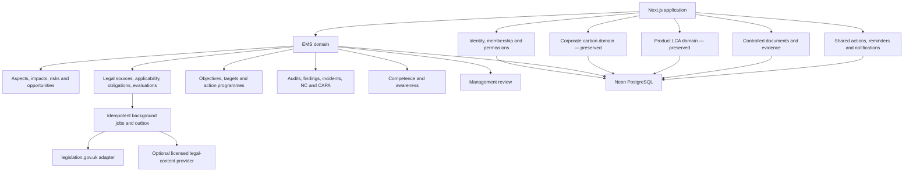
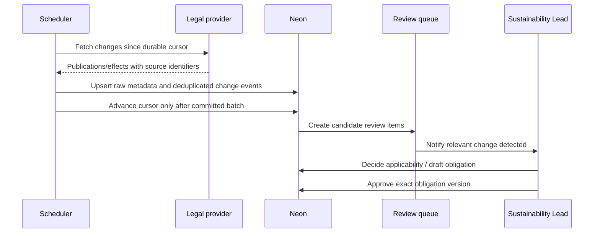

# Multi-Organisation ISO 14001 EMS Expansion Plan

**Target baseline:** ISO 14001:2026, with an explicit configurable standards profile. ISO 14001:2015 and its 2024 climate amendment were withdrawn when the 2026 edition was published. Exact requirement wording and certification evidence criteria must be mapped from the organisation's licensed copy of the standard; this plan deliberately does not reproduce copyrighted clause text.

## 1. Outcomes and non-negotiable constraints

The expanded platform will:

- support multiple customer organisations with strict data isolation;
- retain the current customer's legal entities and sites beneath its organisation;
- preserve corporate carbon and product LCA as separate calculation domains;
- run on Neon PostgreSQL;
- contain no real environmental measurements during development or migration rehearsals;
- allow structural metadata and synthetic fixtures only;
- make the Sustainability Lead the sole default approver of compliance obligations;
- make permissions configurable by organisation without making approval implicit for administrators;
- cover the full requested EMS scope;
- monitor UK legislation through a provider interface, beginning with official legislation.gov.uk data;
- require human applicability, obligation, compliance, and closure decisions; and
- create defensible audit evidence without claiming that software use equals ISO conformity or certification.

## 2. Target architecture



Keep one modular monolith initially. Introduce module boundaries and background workers, not distributed services. Legal sync and notifications may run as separate processes/functions against the same database and shared domain code.

## 3. Tenant and organisation model

### 3.1 Hierarchy

```text
Organisation (SaaS tenant/customer)
├── OrganisationMembership
│   ├── one or more RoleAssignments
│   └── optional Entity/Site access scopes
├── Entity (existing operating/legal company)
│   └── Site (existing facility/office)
├── EMS programme and controlled records
├── Corporate carbon records (existing)
└── Product LCA records (existing)
```

Add `Organisation` above the existing `Entity`; do not rename `Entity` to tenant. This preserves existing business meaning and relationships.

### 3.2 Required identity and permission records

| Record | Purpose |
|---|---|
| `Organisation` | Tenant root, name, slug, status, locale, timezone, default jurisdiction, retention settings |
| `OrganisationMembership` | User-to-organisation relationship, status, dates, invitation and last-access metadata |
| `RoleDefinition` | Organisation-owned or system-template role; editable name and description |
| `PermissionDefinition` | Stable code such as `ems.compliance_obligation.approve` |
| `RolePermission` | Role-to-permission grant |
| `MembershipRole` | Membership-to-role assignment |
| `MembershipScope` | Optional restriction to named entities/sites; absence means organisation-wide scope |
| `AccessReview` | Periodic review evidence for active users and privileged permissions |

Keep `User` global so one identity can belong to several organisations. Remove authorisation dependence on `User.role`; retain it temporarily only for migration compatibility.

### 3.3 Default roles

Seed role templates, not hard-coded behaviour:

- Sustainability Lead
- EMS Contributor / Data Owner
- Site Manager
- Auditor
- Finance / Read-only
- Organisation Administrator

Default permission rule: only Sustainability Lead receives `ems.compliance_obligation.approve`. Organisation Administrator may configure roles and permissions but does not receive that approval permission by default. A customer can explicitly change the mapping, and every grant/revocation is audited.

Enforce separation where relevant:

- an applicability assessment may be prepared by a contributor and approved by an authorised approver;
- a user cannot approve their own compliance obligation when four-eyes control is enabled;
- an audit finding cannot be independently verified by the finding owner;
- a corrective action requires a separate effectiveness review where policy demands it.

### 3.4 Tenant enforcement

Use three layers:

1. **Application context:** every request resolves `userId`, `organisationId`, permissions, and entity/site scopes from current database state.
2. **Repository scoping:** customer-owned reads and mutations require an `OrganisationContext`; unscoped Prisma calls are forbidden outside infrastructure modules.
3. **Database defence:** tenant-consistent foreign keys and, after repository migration, PostgreSQL RLS using a dedicated non-owner application role and transaction-local organisation context.

Do not trust an organisation ID sent by the browser. Resolve accessible organisations from membership, validate any selected organisation server-side, and use opaque IDs only after scope checks.

## 4. EMS information architecture and data model

### 4.1 EMS foundation, context, leadership, and planning

Core records:

- `EmsProgramme`: organisation, standard profile/version, status, scope statement, responsible lead, certification intent, review cycle;
- `EmsScope`: included/excluded entities, sites, activities, products/services, rationale, boundary effective dates;
- `ContextIssue`: internal/external issue, environmental condition, direction of influence, risk/opportunity, owner, review date;
- `InterestedParty` and `InterestedPartyRequirement`;
- `EnvironmentalPolicy` as a controlled document link plus approval/effective dates;
- `EmsRiskOpportunity`: source, likelihood, consequence, controls, actions, residual rating;
- `ChangeAssessment`: proposed change, affected aspects/obligations/controls, approval and implementation review; and
- `StandardRequirementMap`: licensed/internal requirement reference, implementation status, evidence links, owner, next review.

ISO 14001:2026 puts clearer emphasis on environmental context, leadership, measurable outcomes, value-chain oversight, structured risks/opportunities, audit programmes, management review, and management of change. The data model must represent those relationships rather than offer isolated checklists.

### 4.2 Aspects and impacts

Records:

- `ActivityProcess`: organisation/entity/site hierarchy, activity/product/service, lifecycle stage, normal/abnormal/emergency operating condition;
- `EnvironmentalAspect`: input/output/source, direct/indirect control or influence, lifecycle perspective, condition, applicable sites;
- `EnvironmentalImpact`: impact category, beneficial/adverse, local/global, receptor, description;
- `AspectImpactLink`: many-to-many relationship with scoring;
- `SignificanceMethod`: versioned organisation configuration;
- `SignificanceCriterion`: severity, frequency/probability, scale, duration, legal/stakeholder concern, control/influence, emergency potential;
- `AspectAssessment`: score inputs, calculated result, override with rationale, assessor, approval, effective period; and
- `OperationalControl`: control type, procedure/document, owner, frequency, monitoring requirements, suppliers/contractors, effectiveness.

The scoring engine should be deterministic, versioned, and pure like the LCA engine. Never reinterpret an old assessment when scoring configuration changes; create a new assessment version.

Initial process taxonomy may use the supplied structure only:

- Hull: manufacturing, e-ID, mass-transit tickets, smart bureau, software development;
- Rayleigh: metal-card production, smart bureau;
- Milton Keynes / RFID Discovery: office and SaaS operations.

These are structural process profiles, not environmental data. Seed no consumption, emissions, waste, discharge, incident, permit, compliance, or performance values.

### 4.3 Legal register and compliance obligations

Before the legal register, the operational layer also needs explicit support for implementation and performance evaluation:

- `EnvironmentalMonitoringPlan`: parameter, method, location, frequency, acceptance criteria, owner, instrument/provider, calibration or verification requirement;
- `EnvironmentalMonitoringResult`: period/time, result, unit, detection/quality flags, evidence and review status;
- `EquipmentCalibration`: equipment, standard/method, due date, result, certificate and out-of-tolerance response;
- `ExternalProviderControl`: supplier/contractor activity, communicated environmental requirements, competence/evaluation and monitoring;
- `EmergencyScenario`: linked aspects, receptors, triggers, credible consequences and controls;
- `EmergencyPlan`: roles, contacts, containment/response, external communication, resources, revision and controlled-document link;
- `EmergencyExercise`: scenario, participants, outcome, lessons, actions and evidence; and
- `EnvironmentalCommunicationPlan` / `CommunicationRecord`: what, when, with whom, method, owner, approval and retained evidence.

Monitoring values are tenant-owned environmental records and must use Decimal plus explicit units. During development they remain synthetic. Emergency exercises and monitoring exceptions may create incidents, nonconformities or actions through explicit user workflows, never automatic legal conclusions.

### 4.4 Legal register and compliance obligations

Separate five concepts that are often incorrectly collapsed:

1. **Source instrument:** official legislation or another requirement.
2. **Detected change:** new publication, amendment, repeal, modification, or commencement signal.
3. **Applicability assessment:** a human decision about relevance to an organisation, entity, site, activity, or aspect.
4. **Compliance obligation:** the actionable requirement the organisation accepts as applicable, with owner, due/frequency, controls, evidence, and approval.
5. **Compliance evaluation:** periodic, evidenced determination of compliant, noncompliant, partially compliant, or not yet evaluated.

Proposed records:

- `Jurisdiction` and `LegalTopic`;
- `LegalSourceProvider` and `LegalSyncCursor`;
- `LegalInstrument` with canonical URI, type, year/number, title, extent, dates, status, source hash, and last checked time;
- `LegalInstrumentVersion` with retrieved metadata/text references and provenance;
- `LegalChangeEvent` with type, affecting/affected instruments and provisions where available, detected/effective dates, raw-source reference, deduplication key, and review state;
- `ApplicabilityAssessment` with scope, rationale, reviewer, decision, review/expiry dates, and evidence;
- `ComplianceObligation` with stable reference, requirement summary written by a competent person, source provisions, affected scopes/aspects/controls, owner, frequency, status, approval fields, and version;
- `ComplianceObligationApproval` as append-only decision evidence;
- `ComplianceEvaluation` and `ComplianceEvaluationItem`; and
- `OtherRequirementSource` for permits, consents, contracts, customer codes, and voluntary commitments.

Approval state machine:

```text
DRAFT → IN_REVIEW → APPROVED → ACTIVE → SUPERSEDED / RETIRED
                   ↘ REJECTED
```

Only a user with `ems.compliance_obligation.approve` may move a version to `APPROVED`. By default that is the Sustainability Lead only. Approval must record the exact version, decision, approver, time, and comment. Editing an approved obligation creates a draft successor; it never mutates the approved version.

### 4.5 Objectives, targets, and action programmes

Records:

- `EnvironmentalObjective`: policy/aspect/obligation/risk links, baseline description, target, unit, target date, owner, status;
- `ObjectiveMetric`: formula/aggregation definition and data source;
- `ObjectiveMeasurement`: period, value, source, evidence, verifier;
- `ActionProgramme` and `ActionItem`: owner, priority, due date, dependencies, resources, status, completion evidence;
- `ActionProgressUpdate`; and
- `ObjectiveReview`: progress, forecast, decision, changed target rationale.

Existing carbon and LCA results may be linked as read-only metric sources through adapters. Do not copy or recompute them inside EMS tables.

### 4.6 Audits

Records:

- `AuditProgramme`: period, scope, risk basis, objectives, schedule and approval;
- `Audit`: type, criteria, scope, lead, team, independence declaration, dates, status;
- `AuditChecklist` and versioned `AuditQuestion`;
- `AuditEvidenceLink`;
- `AuditFinding`: conformity, observation, opportunity, minor/major nonconformity using organisation-configured terminology;
- `AuditReport`: controlled/frozen issue; and
- links from findings to nonconformities and corrective actions.

Support annual/multi-year programmes and coverage reporting across sites, processes, aspects, obligations, and standard requirements.

### 4.7 Incidents, nonconformities, and corrective action

Keep an incident distinct from a nonconformity while allowing conversion/linking.

- `EnvironmentalIncident`: source, date/time, site, type, severity, immediate response, external notification, confidential fields, evidence;
- `Nonconformity`: origin (incident, audit, compliance evaluation, complaint, monitoring), requirement breached, containment, owner, classification;
- `RootCauseAnalysis`: method, analysis, contributors, approved conclusion;
- `CorrectiveAction`: action, owner, due date, priority, resources, status, evidence;
- `EffectivenessReview`: reviewer, date, criteria, evidence, result, reopen decision; and
- `LessonsLearned` / affected-record links.

State transitions must be explicit and audited. Closure requires permissions, mandatory fields, completed actions, and an effectiveness decision. Overdue actions feed dashboards and management review.

### 4.8 Competence, training, and awareness

Records:

- `CompetenceRequirement`: role/activity/aspect/obligation, required capability, validity and evidence rules;
- `PersonProfile`: internal or contractor identity reference without duplicating login data;
- `CompetenceAssignment`;
- `TrainingCourse` and `TrainingEvent`;
- `CompetenceEvidence`: certificate, assessment, experience, licence, expiry;
- `CompetenceAssessment`: assessor and outcome; and
- `AwarenessCampaign` and acknowledgement.

Provide expiry reminders and gap reports by site/process. Treat sensitive personal data with restricted permissions and defined retention.

### 4.9 Management review

Records:

- `ManagementReview`: period, chair, attendees, scheduled/held dates, status;
- `ManagementReviewAgendaTemplate`;
- `ManagementReviewInput`: changes in context, interested parties, significant aspects, compliance status, objectives, performance trends, incidents/NC/CAPA, audits, resources, communications, opportunities, prior actions;
- `ManagementReviewDecision`: changes, resources, priorities, strategic implications;
- `ManagementReviewAction`; and
- frozen `ManagementReviewPack` and approved minutes.

Generate the pack deterministically from current records and retain a frozen version at issue time. AI may draft a narrative, clearly labelled and human-reviewed, but must not fabricate conclusions.

### 4.10 Shared document control, communications, and evidence

Add:

- `ControlledDocument`, `ControlledDocumentRevision`, reviewers/approvers, effective/obsolete states, review interval, distribution/audience, and change summary;
- generic `EvidenceLink` to any supported record through a controlled attachment service;
- `CommunicationRecord` for required internal/external communications;
- `Notification`, `ReminderRule`, and `Subscription`; and
- shared `ActionItem` only where common workflow semantics genuinely align; otherwise keep domain actions and provide a unified read model.

## 5. UK legal-update integration

### 5.1 Provider architecture

Define `LegalContentProvider` with methods such as:

- `discoverPublications(cursor, jurisdictionFilters)`;
- `getInstrument(canonicalId)`;
- `discoverEffects(cursor, watchedInstrumentIds)`;
- `getVersionMetadata(canonicalId)`; and
- `healthCheck()`.

Implement `LegislationGovUkProvider` first. Keep a second adapter slot for a licensed editorial provider if the organisation later wants curated applicability commentary, guaranteed alerting, or broader non-statutory sources.

### 5.2 Sync flow



Requirements:

- daily discovery by default, with configurable frequency;
- overlap window on every poll to tolerate delayed publication;
- idempotency key from provider, canonical ID, event type, and source version/hash;
- raw payload stored or object-stored with checksum and retrieval time;
- retries with exponential backoff and dead-letter status;
- provider health and stale-cursor alerts;
- separate publication and effects cursors because amendment/effect data can arrive later;
- never delete a source record because it disappears from a feed;
- link affecting and affected legislation without automatically changing an approved obligation; and
- route all candidate changes through human review.

Official legislation data provides authoritative publication and change evidence, but not a customer-specific legal interpretation or a guarantee that every operational requirement has been identified. Permits, regulator notices, local authority requirements, retained EU-derived requirements, contractual obligations, and guidance may require additional sources and competent review.

## 6. Neon production design

- Use a Neon project in the approved region and separate production, staging, and development branches/databases.
- Use pooled `DATABASE_URL` for application traffic and direct `DIRECT_URL` for Prisma CLI/migrations.
- Run migrations once in a controlled release stage with advisory deployment locking; remove migration execution from parallel Next.js builds.
- Use expand/migrate/contract migrations for zero-downtime tenant backfill.
- Use a dedicated application database role; migration owner remains separate.
- Establish recovery objectives, PITR/backup capability, restore drills, and export procedures before production EMS records.
- Encrypt in transit, keep secrets in the deployment platform, rotate credentials, and prohibit production credentials in local `.env` files.
- Add query/job metrics and alarms for connection errors, latency, failed jobs, stale legal cursors, overdue outbox messages, and storage growth.
- Use synthetic fixtures on non-production branches. Do not branch production data into development unless a formally approved sanitisation process exists.

## 7. Migration strategy without environmental-data ingestion

1. Snapshot schema/migration history; do not connect this planning exercise to a live database.
2. Add organisation and permission tables with nullable compatibility columns.
3. Create one initial organisation shell and link existing `Entity` rows structurally in a migration script that can run later against an authorised environment.
4. Convert each existing user into one organisation membership and map the legacy role to a role template.
5. Backfill `organisationId` through structural foreign-key paths only; do not inspect or export measurement values.
6. Add tenant-aware unique constraints and repositories.
7. Run synthetic cross-tenant tests.
8. Enable enforcement and stop using legacy `User.role` for authorisation.
9. Add RLS after the application uses a dedicated role and every request/job sets tenant context transactionally.
10. Remove legacy role fields only in a later contract migration.

Development seeds may include organisations, entities, sites, process names, permission templates, workflow definitions, and fictional users. They must not include actual environmental measurements, incidents, legal conclusions, objectives, compliance statuses, or training records.

## 8. Delivery phases and gates

### Phase 0 — Architecture safety net

- Capture existing calculation/LCA golden tests.
- Add architecture decision records for tenant hierarchy, permission model, audit strategy, jobs, and evidence storage.
- Add CI checks and a rule prohibiting new unscoped Prisma access.
- Configure Neon development/staging using synthetic data only.

**Gate:** existing tests pass; an architecture review accepts the tenancy and migration design.

### Phase 1 — Tenant, identity, and configurable permissions

- Add organisation/membership/role/permission/scope schema.
- Create organisation switcher and tenant-aware session context.
- Backfill structural relationships through migration scripts.
- Refactor repositories and all routes/actions/exports/downloads to require organisation context.
- Add negative cross-tenant tests for every root model and file/export endpoint.
- Introduce audit events for permission and membership changes.

**Gate:** automated tests prove that two synthetic organisations cannot read, mutate, export, reference, or infer each other's records.

### Phase 2 — Shared EMS foundation

- Add EMS programme/scope, context, interested parties, risks/opportunities, management of change, controlled documents, evidence, common audit events, notifications, and jobs/outbox.
- Add site/process profiles using structure only.
- Add permission administration UI and default role templates.

**Gate:** a synthetic organisation can define EMS scope and controlled records with complete audit history.

### Phase 3 — Aspects, impacts, and operational controls

- Add process/activity hierarchy, aspect/impact registers, versioned significance method, assessment workflow, and controls.
- Add deterministic scoring and re-assessment/version behaviour.
- Add links to carbon categories and LCA lifecycle concepts without merging calculation data.
- Add environmental monitoring plans/results, equipment calibration, external-provider controls, communication plans/records, emergency scenarios/plans/exercises, and resulting action links.

**Gate:** a synthetic site can complete, approve, revise, and report an aspect assessment while historic scores remain reproducible, demonstrate controlled monitoring and external-provider requirements, and run a synthetic emergency exercise through lessons/actions.

### Phase 4 — Legal register and compliance evaluation

- Add provider-neutral legal schema and official UK connector.
- Add scheduled publication/effects sync, durable cursors, review queue, and source-health monitoring.
- Add applicability, obligation drafting/versioning, Sustainability Lead default approval, and compliance evaluations.
- Add other-requirement sources and manual source capture.

**Gate:** recorded official fixtures produce idempotent change events; only the configured approver can approve; no source event automatically creates or changes an active obligation.

### Phase 5 — Objectives, actions, and performance

- Add objectives, metrics, targets, programmes, actions, progress, evidence, reminders, and dashboards.
- Add read-only adapters for selected carbon/LCA results.

**Gate:** progress is traceable to source measurements/evidence and changes to targets are versioned and approved.

### Phase 6 — Audits, incidents, NC, and CAPA

- Add audit programmes, audits, checklists, evidence, reports, and findings.
- Add incident intake, nonconformity, containment, root cause, corrective action, effectiveness review, closure, and escalation.
- Enforce independence/separation policies.

**Gate:** end-to-end synthetic audit and incident scenarios create frozen evidence and cannot bypass closure criteria.

### Phase 7 — Competence and management review

- Add competence requirements, training/evidence/expiry, assessments, and awareness.
- Add management-review scheduling, deterministic input pack, decisions, minutes, and actions.

**Gate:** the system produces a frozen synthetic review pack with linked source records, open actions, and an auditable approval.

### Phase 8 — Hardening and pilot

- Threat model, penetration test, accessibility review, disaster-recovery exercise, performance/load test, audit-log integrity review, and privacy/retention review.
- Complete licensed ISO requirement mapping and internal legal/compliance review.
- Pilot with structure and synthetic data first; ingest real records only under a separately approved data migration/onboarding plan.

**Gate:** signed operational readiness, security, data-protection, EMS-owner, and legal-content decisions.

## 9. Acceptance principles across all phases

- Existing carbon and LCA calculations remain byte-for-byte or value-for-value stable under golden fixtures.
- No query, mutation, download, export, background job, notification, or AI context crosses an organisation boundary.
- Every approval is tied to a version and current permission checked from the database.
- Every material state transition produces an append-only audit event.
- No real environmental data appears in fixtures, logs, prompts, tests, screenshots, or preview environments.
- AI outputs remain proposals and cannot perform controlled decisions.
- Legal source content and human decisions retain provenance and are never silently overwritten.
- Issued reports, approved obligations, audit reports, management-review packs, and controlled-document revisions are immutable.
- Accessibility, plain language, filtering, exports, and evidence retrieval are tested for each module.

## 10. Key decisions still requiring owner approval

These do not block schema/task decomposition, but they must be decided before production:

1. Neon region, service tier, recovery objectives, and data-processing terms.
2. Authentication roadmap: credentials initially versus Microsoft/Google SSO, MFA, and SCIM.
3. Whether site-scoped roles are required for the first organisation or only for future tenants.
4. Exact aspect significance formula and approval policy.
5. Legal-content approach: official-source monitoring only, or an additional licensed editorial provider.
6. Competent-person/legal-review responsibilities and review frequency.
7. Evidence retention, deletion holds, and employee training-data privacy.
8. Corrective-action closure and independent-effectiveness-review rules.
9. Certification target and transition plan for ISO 14001:2026.
10. When and how real environmental records may be onboarded; this plan grants no such authority.

## 11. External technical references

- ISO announced ISO 14001:2026 on 15 April 2026 and describes stronger focus on environmental context, leadership, value-chain oversight, measurable outcomes, audit programmes, management review, and management of change: https://www.iso.org/news/2026/04/iso-14001-2026-published and https://www.iso.org/climate-change/iso-14001-what-has-changed
- ISO identifies the 2015 edition and 2024 amendment as withdrawn and replaced by the 2026 edition: https://www.iso.org/obp/ui#iso:std:iso:14001:ed-4:v1:en
- The National Archives' official legislation service/API guide and data-completeness material: https://cdn.nationalarchives.gov.uk/documents/cas-82049-legislation-service-guide.pdf and https://cdn.nationalarchives.gov.uk/documents/cas-82049-legislation-date.pdf
- Prisma's current Neon guidance recommends pooled runtime and direct CLI connection strings: https://docs.prisma.io/docs/orm/v6/overview/databases/neon
- Neon documents connection pooling and a shared-table multi-tenant approach with foreign keys/RLS: https://neon.com/docs/connect/connection-pooling and https://neon.com/docs/guides/multitenancy
