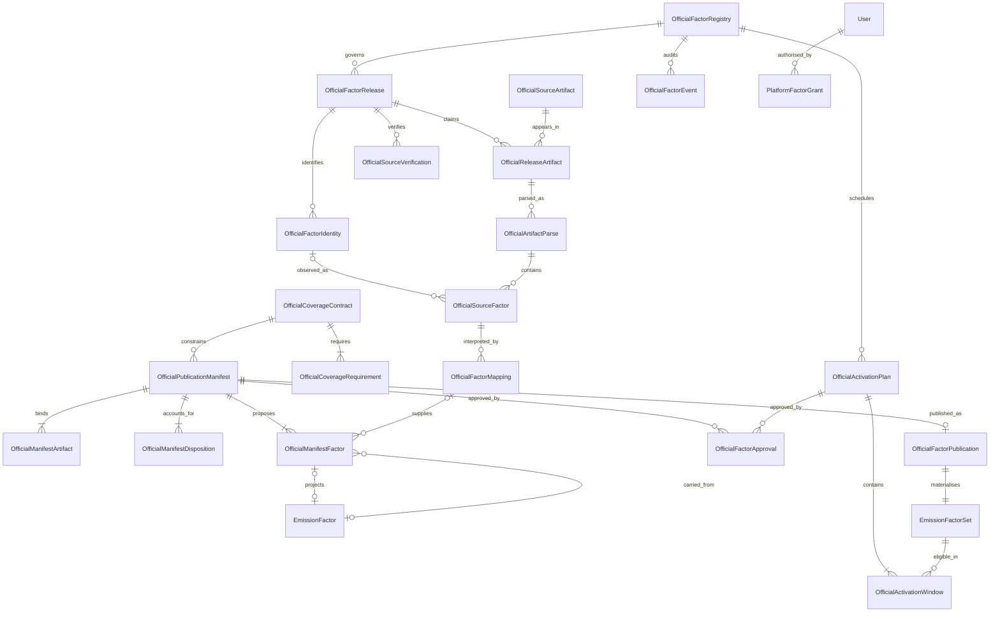

# Phase 3-v: official factor publication schema and contract

Status: proposed design; implementation and activation require later authorisation.

Reviewed against `board/product-2026-09-22` at
`9cf953842cd5b473f9d24c9722594030e0052540`, on 2026-09-15. This document is the
only deliverable of this phase. It does not authorise schema changes, migrations,
database access, persistence, enabling import/commit, recalculation, deployment,
or merging PR #64. The official workbook remains outside the repository.

## 1. Decisions and existing contracts

Use a separate, platform-owned source and review domain. Keep `EmissionFactorSet`
and `EmissionFactor` as an immutable **published projection**, but only after all
relevant readers understand explicit eligibility. Parsing, mapping, approval,
publication and activation are different operations. A successful parse or a
warning-free preview is never publication authority.

Publication and activation are separate transactions with separately bound
approvals. Publication creates a complete, inactive projection. Activation switches
an approved schedule of activity-period intervals to eligible sets. Neither
operation calculates entries or changes existing calculation/report snapshots.

### Repository evidence

| Existing contract | Consequence for this design |
| --- | --- |
| [Phase 3-iii calibration](PHASE3_III_OFFICIAL_WORKBOOK_CALIBRATION.md): 8,772 scanned, 8,740 candidate rows, 0 accepted, 773 warning, 7,967 rejected; no duplicates/conflicts; 70 excessive-precision values | These are preview results, not a persistent approval or an accepted inventory. Preserve the baseline and all rejected observations. |
| [Phase 3-i](PHASE3_I_FACTOR_IMPORT.md), [Phase 3-ii](PHASE3_II_FACTOR_IMPORT_UI.md), `src/lib/factors/import/*` | `commitAllowed` remains false. Future acceptance changes must not make commit possible by themselves. |
| `prisma/schema.prisma`: `EmissionFactorSet`, `EmissionFactor`, `Calculation` | No publication eligibility field; factor and factor-value snapshot columns use `Decimal(18,8)`. LCA boundary fields have a separate purpose. |
| `src/lib/entries-service.ts`: `findFactorSet` | Selects the newest date-eligible visible set; does not check active/approved state or fall back to an older official set when a key is missing. An inactive flag alone is ineffective until readers use it. |
| `findFactorInSet` | Lookup is `(setId, category, subtypeKey, basis)`. Region, unit and emissions boundary are not lookup dimensions. Multiple such variants under one key are unsafe. |
| `resolveFactorMultiSource` | Supplier-specific exact subtype, then supplier default; official exact key; then EEIO. Preserve this order and the existing dedicated Scope 1/2 paths. |
| `toFactorRow`, `src/lib/calc-engine.ts` | Attribution/vintage currently come from the containing set; values become JavaScript numbers; unit equality is literal. Carry-forward needs a provenance-aware adapter, not just extra links. |
| `src/lib/scope3-derived.ts` | Natural gas maps to `wtt_natural_gas`; diesel to `wtt_diesel`; road fuel/mileage preserve subtype; grid location-based electricity maps to T&D. Purchased heat has no current WTT derivation. |
| `src/lib/factor-sets-service.ts`: `commitFactorImport` | Changes predecessor dates and calls `recalculatePendingEntries` after commit. Do not reuse this operation for official publication. |
| `src/lib/rbac/authorize.ts`, `role-templates.ts` | Organisation permissions and configurable four-eyes checks are not platform publication authority. `carbon.factor.manage` is granted to no production role template. Legacy `User.role` is not the new authority source. |
| `src/lib/repositories/audit-repository.ts`, `AuditEvent` | Audit chains require an organisation and an organisation lock. Platform factor events need a separate stream; do not invent an organisation to satisfy the FK. |
| `EvidenceObject`, `EvidenceObjectBlob`, document storage provider | Existing evidence objects require an organisation. Reuse appropriate storage mechanics only; do not attach platform source files to a fake tenant or default to database workbook blobs. |
| Existing factor-import, tenant and audit migrations; Prisma dependency `^6.19.2` | Use additive tables/columns, explicit physical names and reviewed SQL for constraints Prisma cannot express. Database server version and installed extensions have not been inspected. |

### Boundary of the first implementation

Corporate factors only. Direct combustion, WTT, T&D and combined boundaries are
distinct. Whole-gas CO2e, individual gas contributions and energy conversions are
distinct measures. No fuzzy matching, automatic default geography, lost CV/RF/load
qualifiers, rounded factor, guessed market-based electricity, or product-LCA use.

## 2. Entity relationship overview

The registry has one nullable pointer to its current activation plan. An old plan
is retained, so both activity-time applicability and the history of activation
decisions can be reconstructed. Source observations and logical identity are
separate: duplicate appearances and conflicting values remain inspectable without
allowing two logical identities for one release/key.

## 3. Proposed Prisma model and field inventory

These are design inventories, not an executable Prisma schema. All scalar fields
and critical relations are specified below; inverse Prisma relation arrays add no
columns. `?` means nullable. Unless stated otherwise: `id String @id @default(cuid())`,
strings use PostgreSQL text, hashes use lowercase SHA-256 hex `String @db.Char(64)`,
timestamps use `DateTime @db.Timestamptz(3)`, and `createdAt` defaults to `now()`.
Dates explicitly marked `Date` use `DateTime @db.Date`. No source numeric goes
through a Prisma/JavaScript floating-point number. All FK deletion actions are
`Restrict`, including actor references; retain/pseudonymise users instead of
deleting audit lineage. IDs are not authority tokens.

Four aggregate headers also have `sealedAt DateTime?`: `OfficialArtifactParse`,
`OfficialCoverageContract`, `OfficialPublicationManifest` and
`OfficialActivationPlan`. Null is permitted only while constructing the aggregate
inside its creation transaction. Insert header and children, validate/hash them,
then set sealedAt once. A deferred `of_<alias>_seal_complete_trg` requires a non-null
seal at commit; no incomplete header can survive. Child-write triggers lock the
parent and reject inserts/updates/deletes after sealing. Header updates after
sealing are refused. This supplies an explicit database mechanism for immutable
aggregates, including protection against adding a child after approval.

### 3.1 Registry, releases and immutable files

| Prisma model / physical table | Fields and contract |
| --- | --- |
| `OfficialFactorRegistry` / `of_registry` | `id`; `namespace String`; `publisherCode String`; `datasetFamily String`; `applicationDomain OfficialApplicationDomain`; `geographyProfile String`; `mode OfficialRegistryMode @default(LEGACY)`; `generation Int @default(0)`; `currentPlanId String? -> OfficialActivationPlan`; `nextEventSequence BigInt @default(1)`; `lastEventHash String?`; `createdAt`. One registry for `UK_GOV_GHG_COMPANY_REPORTING / CORPORATE / GB`; this is a resolver namespace, not the source's claim about every row's geography. Row lock serialises activation and audit. Audit increments do not change `generation`. |
| `OfficialFactorRelease` / `of_release` | `id`; `registryId -> OfficialFactorRegistry`; `reportingYear Int`; `revisionKey String`; `officialVersion String?`; `publisherName String`; `publicationDate Date?`; `publisherUpdateDate Date?`; `workbookUpdateDate Date?`; `sourceUrl String`; `methodologyUrl String?`; `declaredEffectiveFrom Date?`; `declaredEffectiveTo Date?`; `revisionEvidence String`; `status OfficialReleaseStatus @default(REGISTERED)`; `createdByUserId -> User`; `createdAt`. Dates are observations with evidence, not implicit runtime eligibility. Identity fields cannot change after registration; mistakes create a new claim and an audited withdrawal. Status is a controlled, audited lifecycle cache. |
| `OfficialSourceArtifact` / `of_artifact` | `id`; `sha256`; `byteSize BigInt`; `firstFileName String`; `fileFormat OfficialArtifactFormat`; `storageProvider String`; `storageKey String`; `storageVersion String`; `mediaType String`; `firstRetrievedAt DateTime`; `firstSourceUrl String`; `storageState OfficialStorageState`; `createdByUserId -> User`; `createdAt`. Insert the immutable metadata record only once bytes have been uploaded, bounded/scanned and hash-verified. A later integrity failure can quarantine it, never replace bytes or a pinned storage version. |
| `OfficialReleaseArtifact` / `of_release_artifact` | `id`; `releaseId -> OfficialFactorRelease`; `artifactId -> OfficialSourceArtifact`; `artifactKind OfficialArtifactKind`; `variantKey String` (non-null, e.g. `en`); `fileName String`; `retrievedAt DateTime`; `sourceUrl String`; `role OfficialArtifactRole @default(CLAIMED)`; `roleRationale String?`; `claimedByUserId -> User`; `createdAt`. Immutable claim identity and retrieval evidence. Role/rationale transitions are audited and invalidate verification; they do not mutate the artifact. Multiple claims may coexist; only one authoritative factor artifact per kind/variant is allowed. |
| `OfficialSourceVerification` / `of_verification` | `id`; `releaseId -> OfficialFactorRelease`; `inventoryHash`; `verificationHash`; `verificationPolicyVersion String`; `verifiedByUserId -> User`; `verifiedAt DateTime`; `rationale String`; `evidence Json`; `revokedAt DateTime?`; `revokedByUserId String? -> User`; `revocationReason String?`. Evidence supplements linked artifact claims and source URLs; hashes bind their exact roles, bytes and release metadata. Body is immutable; revocation is one-way and audited. |

An artifact may belong to multiple releases: an unchanged full-set file can be
associated with a later corrected flat-file release, but only with explicit
publisher evidence. The association is not inferred from matching bytes. A
different file hash is a new artifact, even when its filename is identical.

`REGISTERED -> VERIFIED` requires a current verification. Any new artifact claim,
role change, unresolved content conflict or changed authoritative metadata moves
the release to `RECONCILIATION_REQUIRED` and invalidates the inventory hash.
`WITHDRAWN` prevents new publication/activation; already activated use requires an
explicit remedial activation plan, not silent deletion or recalculation.

Store bytes in an immutable, content-addressed, platform storage namespace with
retention at least as long as dependent reports/lineage. No expiring URL is the
only surviving reference. The provider and versioning/retention capability must
be selected before persistence. A database workbook blob is not the default.
Repeated retrievals are audited against the existing artifact without modifying
its first-observed metadata. Unreferenced failed-upload objects may be collected;
referenced source bytes may not be garbage-collected.

### 3.2 Parsing, logical identity and mapping

| Prisma model / physical table | Fields and contract |
| --- | --- |
| `OfficialArtifactParse` / `of_parse` | `id`; `releaseArtifactId -> OfficialReleaseArtifact`; `parserVersion String`; `sourceProfileVersion String`; `identityVersion String`; `validationVersion String`; `parseKey`; `parseHash`; `scannedCount Int`; `candidateCount Int`; `skippedCount Int`; `warningCount Int`; `rejectedCount Int`; `sheetSummary Json`; `createdByUserId -> User`; `createdAt`. A completed immutable parse, never an upload/job state. Same inputs/versions must reproduce the same hash or fail nondeterminism checks. Failed attempts are audit events, not successful parse records. |
| `OfficialFactorIdentity` / `of_identity` | `id`; `releaseId -> OfficialFactorRelease`; `identityVersion String`; `sourceIdentityHash`; `canonicalIdentity String`; `createdAt`. One logical source identity; excludes value, physical row and application mapping. No canonical value is chosen by whichever artifact arrived first. |
| `OfficialSourceFactor` / `of_source_factor` | `id`; `parseId -> OfficialArtifactParse`; `identityId String? -> OfficialFactorIdentity`; `sheet String`; `sourceRow Int`; `sourceColumnKey String`; `officialSourceId String?`; `rawScope String?`; `level1 String?`; `level2 String?`; `level3 String?`; `level4 String?`; `columnText String?`; `rawFactorText String?`; `rawNumericToken String?`; `numericKind OfficialNumericKind`; `exactCoefficient String?`; `exactExponent Int?`; `rawUnit String?`; `canonicalSourceUnit String?`; `rawGas String?`; `gasMeasure OfficialGasMeasure`; `gasSpecies String?`; `rawBoundary String?`; `boundaryClass OfficialCorporateBoundary`; `rawGeography String?`; `sourceGeography String?`; `geographyEvidence String?`; `cvBasis OfficialCvBasis`; `rfChoice OfficialRfChoice`; `loadDescription String?`; `occupancyDescription String?`; `vehicleClass String?`; `sourceQualifiers Json`; `rawCells Json`; `parseStatus OfficialParseStatus`; `validationCodes Json`; `observationHash`; `semanticValueHash`; `createdAt`. Immutable observation, including invalid/missing values and conflicts. Unknown identity is null and cannot be mapped. Full/wide future layouts use distinct `sourceColumnKey` for each observed measure. |
| `OfficialFactorMapping` / `of_mapping` | `id`; `identityId -> OfficialFactorIdentity`; `sourceFactorId -> OfficialSourceFactor`; `targetSlot String`; `revision Int`; `supersedesMappingId String? -> OfficialFactorMapping`; `decision OfficialMappingDecision`; `targetCategory String?`; `targetSubtype String?`; `targetSubtypeIdentity String?`; `targetUnit String?`; `factorBasis FactorBasis?`; `reportingScope Scope?`; `scope3Category String?`; `emissionsBoundary OfficialCorporateBoundary`; `gasMeasure OfficialGasMeasure`; `applicabilityGeography String?`; `geographyRationale String?`; `cvBasis OfficialCvBasis`; `qualifierPolicy String?`; `transform OfficialValueTransform`; `interpretedCoefficient String?`; `interpretedExponent Int?`; `mappingRuleVersion String`; `rationale String`; `mappedByUserId -> User`; `mappedAt DateTime`; `mappingHash`. Immutable revision. `sourceFactorId/identityId` is a composite FK to the matching source observation/identity. |

Parse records account for all candidate rows, including those that fail numeric
or semantic checks. Skipped headings, metadata and blank lines remain counted in
the parse summary; they are not fabricated factors. A parse and its observations
are sealed together after all observations are present. Subsequent inserts,
updates and deletes against a sealed parse are refused.

Logical identity permits multiple observations. Equivalent full/flat observations
must match their exact semantic values after an approved source-format adapter.
A mismatch remains a conflict until source reconciliation identifies an
authoritative observation with evidence. Neither first-write-wins nor averaging
is allowed. Unsupported full-set layouts may be archived as companion evidence;
they may not contribute mapped values until separately calibrated.

`targetSlot` identifies a mapping stream: the canonical runtime lookup tuple, or
the reserved `UNMAPPED` stream. Revision 1 has no predecessor; revision N must
reference N-1 in the same identity/slot stream. A source can deliberately supply
more than one target only through separate, justified mapping streams. One stream
has no forks; a superseded mapping is never edited. Approval selects exact
revision IDs, not whichever mapping is currently newest. A new revision does not
change old manifests, but blocks publishing an older revision by default unless
the new manifest explicitly explains and independently approves its selection.

### 3.3 Coverage and immutable publication proposal

| Prisma model / physical table | Fields and contract |
| --- | --- |
| `OfficialCoverageContract` / `of_coverage` | `id`; `registryId -> OfficialFactorRegistry`; `revision Int`; `predecessorId String? -> OfficialCoverageContract`; `profileName String`; `purpose OfficialManifestPurpose`; `productContractVersion String`; `coverageHash`; `rationale String`; `createdByUserId -> User`; `createdAt`. Immutable, with all requirements sealed atomically. Production contracts describe the entire supported official lookup surface for the proposed period. |
| `OfficialCoverageRequirement` / `of_requirement` | `id`; `coverageContractId -> OfficialCoverageContract`; `lookupKey String`; `category String`; `subtype String?`; `subtypeIdentity String`; `basis FactorBasis`; `unit String`; `scope Scope`; `scope3Category String?`; `boundary OfficialCorporateBoundary`; `gasMeasure OfficialGasMeasure`; `geography String`; `cvBasis OfficialCvBasis`; `carryForwardAllowed Boolean @default(false)`; `level OfficialCoverageLevel @default(MANDATORY)`; `companionOfId String? -> OfficialCoverageRequirement`; `rationale String`. Requirements default to mandatory; optional capabilities must be explicitly justified in a versioned contract. Companion must belong to the same contract. |
| `OfficialPublicationManifest` / `of_manifest` | `id`; `registryId -> OfficialFactorRegistry`; `primaryReleaseId -> OfficialFactorRelease`; `coverageContractId -> OfficialCoverageContract`; `baselinePlanId String? -> OfficialActivationPlan`; `baselineGeneration Int`; `purpose OfficialManifestPurpose`; `proposedName String`; `applicableFrom DateTime`; `applicableUntil DateTime?` (exclusive); `manifestHash`; `manifestFormatVersion String`; `validationVersion String`; `mappingRuleVersion String`; `numericPolicyVersion String`; `approvalPolicyVersion String`; `sourceCounts Json`; `coverageMetrics Json`; `warningSummary Json`; `createdByUserId -> User`; `createdAt`. Immutable sealed proposal, including all child records. Status is derived from approvals/publication/revocation; do not maintain an editable approved manifest. |
| `OfficialManifestArtifact` / `of_manifest_artifact` | `id`; `manifestId -> OfficialPublicationManifest`; `releaseArtifactId -> OfficialReleaseArtifact`; `verificationId -> OfficialSourceVerification`; `parseId String? -> OfficialArtifactParse`; `use OfficialManifestArtifactUse`; `boundArtifactHash`; `boundInventoryHash`; `boundParseHash String?`. Factor input requires a completed parse; methodology/evidence may have no parse. All relevant source and carried-forward official release artifacts are linked. Verification, release association and parse must agree. |
| `OfficialManifestDisposition` / `of_disposition` | `id`; `manifestId -> OfficialPublicationManifest`; `sourceFactorId -> OfficialSourceFactor`; `decision OfficialDisposition`; `reasonCode String`; `rationale String`; `acknowledgedWarningCodes Json`. Exactly one decision per observation in every input parse. No missing candidate and no outside observation is allowed. |
| `OfficialManifestFactor` / `of_manifest_factor` | `id`; `manifestId -> OfficialPublicationManifest`; `coverageRequirementId -> OfficialCoverageRequirement`; `origin OfficialFactorOrigin`; `mappingId String? -> OfficialFactorMapping`; `dispositionId String? -> OfficialManifestDisposition`; `predecessorFactorId String? -> EmissionFactor`; `rootSourceFactorId String? -> OfficialSourceFactor`; `sourceReleaseId String? -> OfficialFactorRelease`; `originalSourceName String`; `originalPublisher String`; `originalVintageYear Int`; `originalSourceUrl String?`; `lookupKey String`; `targetCategory String`; `targetSubtype String?`; `targetSubtypeIdentity String`; `factorBasis FactorBasis`; `reportingScope Scope`; `scope3Category String?`; `targetUnit String`; `geography String`; `emissionsBoundary OfficialCorporateBoundary`; `gasMeasure OfficialGasMeasure`; `cvBasis OfficialCvBasis`; `exactCoefficient String`; `exactExponent Int`; `candidateValue Decimal @db.Decimal(18,8)`; `carryForwardRationale String?`; `carryValidFrom DateTime?`; `carryValidUntil DateTime?`; `itemHash`. This sealed item is also the typed publication lineage record. It becomes published lineage only when its manifest is materialised. |

`NEW_OFFICIAL` requires mapping, selected disposition, root source and source
release; no predecessor is required. An optional predecessor on a new replacement
is a comparison link only, never substituted for its new source provenance.
`CARRY_FORWARD` requires the predecessor and a reviewed validity interval/rationale;
mapping/disposition are null. Its root source and release are copied through typed
links when known. A legacy manual factor may genuinely have no official source
record; keep these null and preserve its real attribution. Never invent one.

Every runtime item satisfies one requirement and every mandatory requirement has
exactly one item. An explicitly optional requirement has zero or one item. No
additional unrequired runtime rows in the first publication contract.
An observation selected once may supply several justified mapping slots; this is
why source dispositions and proposed runtime factors are separate tables.

### 3.4 Authority, materialisation and activity-period schedule

| Prisma model / physical table | Fields and contract |
| --- | --- |
| `PlatformFactorGrant` / `of_grant` | `id`; `userId -> User`; `capability OfficialFactorCapability`; `grantedByUserId -> User`; `grantedAt DateTime`; `expiresAt DateTime?`; `revokedAt DateTime?`; `revokedByUserId String? -> User`; `reason String`. Dedicated platform authority; independent of organisation membership and `User.role`. Grant body immutable; audited one-way revocation. Expired grants must be revoked before regranting the same capability. |
| `OfficialFactorApproval` / `of_approval` | `id`; `manifestId String? -> OfficialPublicationManifest`; `activationPlanId String? -> OfficialActivationPlan`; `purpose OfficialApprovalPurpose`; `subjectHash`; `approvalPolicyVersion String`; `contributorsHash`; `approverUserId -> User`; `approvedAt DateTime`; `expiresAt DateTime`; `rationale String`; `revokedAt DateTime?`; `revokedByUserId String? -> User`; `revocationReason String?`. Exactly one subject FK. Immutable signed-off body; one-way audited revocation. Fresh expiry needs a new approval. |
| `OfficialFactorPublication` / `of_publication` | `id`; `manifestId -> OfficialPublicationManifest`; `factorSetId -> EmissionFactorSet`; `reviewApprovalId -> OfficialFactorApproval`; `publishApprovalId -> OfficialFactorApproval`; `idempotencyKey String`; `requestHash`; `publishedByUserId -> User`; `publishedAt DateTime`; `projectionHash`; `publicationContractVersion String`. One committed success, not a mutable job. No row survives a failed materialisation transaction. |
| `OfficialActivationPlan` / `of_plan` | `id`; `registryId -> OfficialFactorRegistry`; `revision Int`; `expectedPreviousPlanId String? -> OfficialActivationPlan`; `expectedGeneration Int`; `planHash`; `activationPolicyVersion String`; `createdByUserId -> User`; `createdAt`; `reason String`. Immutable complete replacement schedule, not an incremental date patch. Initial revision is 1; every later plan expects the currently active generation. Competing proposals may share an expected generation but have distinct IDs/hashes; only one can activate. |
| `OfficialActivationWindow` / `of_window` | `id`; `planId -> OfficialActivationPlan`; `factorSetId -> EmissionFactorSet`; `fromInclusive DateTime`; `untilExclusive DateTime?`; `coverageManifestId String? -> OfficialPublicationManifest`; `legacyCoverageContractId String? -> OfficialCoverageContract`; `legacyAssessmentHash String?`; `legacyAssessment Json?`; `rationale String`. Managed set requires its publication manifest. Legacy bootstrap requires a complete, approved assessment and coverage contract, with frozen exact factor IDs/values/attribution. No unaudited legacy bypass. |
| `OfficialFactorEvent` / `of_event` | `id`; `registryId -> OfficialFactorRegistry`; `sequence BigInt`; `eventType OfficialFactorEventType`; `actorUserId String? -> User`; `actorKind OfficialActorKind`; `releaseId String? -> OfficialFactorRelease`; `artifactId String? -> OfficialSourceArtifact`; `mappingId String? -> OfficialFactorMapping`; `manifestId String? -> OfficialPublicationManifest`; `publicationId String? -> OfficialFactorPublication`; `activationPlanId String? -> OfficialActivationPlan`; `activationGeneration Int?`; `grantId String? -> PlatformFactorGrant`; `approvalId String? -> OfficialFactorApproval`; `correlationId String`; `occurredAt DateTime`; `summary String`; `details Json`; `previousEventHash String?`; `contentHash`. Append-only platform stream with critical subject relations; JSON carries supplemental diffs/check results. Successful activation requires activationPlanId, its exact ACTIVATE approvalId and the new activationGeneration; approval relations to the plan preserve the full approval history. |

### 3.5 Additive changes to existing models (schema implemented in Phase 3-vi; runtime rules remain future)

| Model | Proposed addition / restriction |
| --- | --- |
| `EmissionFactorSet` | `officialManagement OfficialSetManagement?` with no database default or backfill, plus inverse relation to its one `OfficialFactorPublication` and activation windows. Null retains legacy behaviour. In Phase 3-vii, `GUARDED` sets become eligible only via the current registry plan; legacy predicates must explicitly include null. No mutable `ACTIVE` boolean: eligibility is a period-dependent schedule relation. |
| `EmissionFactor` | `officialManifestFactorId String? @unique -> OfficialManifestFactor`; `publishedLookupKey String?`; inverse predecessor-item relation. Null fields retain legacy behavior. Every factor in a guarded set must have both fields and exactly match its sealed item. A guarded set cannot contain legacy/unlinked rows. |
| `User` | Inverse relations for platform grants, approvals, source/mapping authors and audit actors. No new use of the deprecated role field. |
| `Calculation`, report snapshots, tenant RBAC/audit/evidence models | No column/type change in the initial design. Existing snapshots stay immutable. The future factor-to-calculation adapter must use the item’s original attribution/vintage for guarded factors. |

Runtime set metadata describes the **assembled publication**, not provenance for
every child. Use an honest name such as “Carbon Ledger reviewed UK corporate
factor set — 2026 revision 1”; do not call carried-forward values official 2026
values. Store the set's publication vintage as the assembly year, while each item
retains its original factor vintage. `isPlaceholder=false` is allowed only when
all rows are verified usable; a carried placeholder cannot be laundered into a
verified set. The original official publisher/release remains linked separately.

## 4. Enum definitions

Use these proposed values, with short physical enum names such as `of_boundary`.
Existing `Scope`, `FactorBasis`, `FactorVisibility` and `FactorSourceType` are reused.

| Enum | Values |
| --- | --- |
| `OfficialApplicationDomain` | `CORPORATE` |
| `OfficialRegistryMode` | `LEGACY`, `MANAGED` |
| `OfficialSetManagement` | `LEGACY`, `GUARDED` |
| `OfficialReleaseStatus` | `REGISTERED`, `RECONCILIATION_REQUIRED`, `VERIFIED`, `WITHDRAWN` |
| `OfficialArtifactFormat` | `XLSX`, `CSV`, `PDF`, `HTML`, `OTHER` |
| `OfficialArtifactKind` | `FLAT`, `FULL`, `CONDENSED`, `METHODOLOGY`, `GUIDANCE`, `ERRATA`, `OTHER` |
| `OfficialArtifactRole` | `CLAIMED`, `AUTHORITATIVE`, `COMPANION`, `SUPERSEDED`, `REJECTED` |
| `OfficialStorageState` | `READY`, `QUARANTINED` |
| `OfficialNumericKind` | `FINITE`, `MISSING`, `INVALID`, `FORMULA`, `ERROR` |
| `OfficialParseStatus` | `VALID`, `WARNING`, `REJECTED` (source validation only) |
| `OfficialGasMeasure` | `WHOLE_GAS_CO2E`, `GAS_CONTRIBUTION_CO2E`, `GAS_MASS`, `ENERGY_CONVERSION`, `UNKNOWN` |
| `OfficialCorporateBoundary` | `DIRECT`, `WTT`, `TD_LOSSES`, `COMBINED`, `OTHER_REVIEWED`, `UNREVIEWED` |
| `OfficialCvBasis` | `GROSS`, `NET`, `NOT_APPLICABLE`, `UNSPECIFIED` |
| `OfficialRfChoice` | `WITH_RF`, `WITHOUT_RF`, `NOT_APPLICABLE`, `UNSPECIFIED` |
| `OfficialMappingDecision` | `MAPPED`, `UNMAPPED`, `REJECTED` |
| `OfficialValueTransform` | `IDENTITY`, `EXACT_UNIT_SCALE` (second value reserved; blocked initially) |
| `OfficialManifestPurpose` | `PRODUCTION_COMPLETE`, `TEST_ONLY` |
| `OfficialManifestArtifactUse` | `FACTOR_INPUT`, `PROVENANCE`, `METHODOLOGY`, `ERRATA` |
| `OfficialDisposition` | `SELECTED`, `EXCLUDED`, `REJECTED`, `DUPLICATE` |
| `OfficialFactorOrigin` | `NEW_OFFICIAL`, `CARRY_FORWARD` |
| `OfficialApprovalPurpose` | `MANIFEST_REVIEW`, `PUBLISH`, `ACTIVATE` |
| `OfficialFactorCapability` | `VIEW`, `VERIFY_SOURCE`, `MAP`, `REVIEW`, `PUBLISH`, `ACTIVATE`, `MANAGE_GRANTS` |
| `OfficialActorKind` | `USER`, `SYSTEM` |
| `OfficialFactorEventType` | `RELEASE_REGISTERED`, `SOURCE_CLAIMED`, `SOURCE_RECONCILED`, `SOURCE_VERIFIED`, `SOURCE_WITHDRAWN`, `ARTIFACT_QUARANTINED`, `PARSE_SEALED`, `MAPPING_CREATED`, `MANIFEST_SEALED`, `APPROVAL_GRANTED`, `APPROVAL_REVOKED`, `PUBLICATION_SUCCEEDED`, `PUBLICATION_FAILED`, `PLAN_SEALED`, `ACTIVATION_SUCCEEDED`, `ACTIVATION_FAILED`, `GRANT_CREATED`, `GRANT_REVOKED` |

Enum representation alone does not make a row publishable. For example `COMBINED`
is representable in source/review records but excluded from the initial runtime
projection. A new future transform requires its own exact parameters, rule version,
approval and tests before the reserved enum value can be used.

## 5. Source identity, hashes and database uniqueness

### 5.1 Release and file identity

Database release key: `(registryId, reportingYear, revisionKey)`; all non-null.
`revisionKey` is a reviewed official revision identifier, not a filename, upload
timestamp or local attempt ID. Preserve `officialVersion` verbatim separately.
Use `version:<official-version>` where sufficient; when an official correction
reuses that version, append an evidenced publisher correction identifier/date and
format scope, e.g. `version:1.2|correction:2026-07-31:flat`. Do not invent a revision
just to evade a same-release hash conflict. Unresolved release claims cannot be
verified. Publisher reorganisations do not change the stable dataset namespace.

Full and flat artifacts can share a release only after verification. The 2026
workbook's internal `2026-07-10` update, initial publication and corrected-flat web
publication are distinct observations. The [GOV.UK publication history](https://www.gov.uk/government/publications/greenhouse-gas-reporting-conversion-factors-2026)
is the authority for web release events; a local workbook title is insufficient
proof of download provenance.

Artifact identity is global exact-byte SHA-256, with byte size checked on conflict.
Reuse by different release claims is recorded through `OfficialReleaseArtifact`.
A SHA match with different size/bytes or canonical content is a corruption/collision
incident, not a retry success. A different hash in an already claimed artifact
slot creates a reconciliation event and cannot silently replace the selected file.

### 5.2 Logical source and runtime identities

Use a versioned canonical serializer: UTF-8, Unicode NFC, ordered typed arrays or
objects with sorted keys, explicit null distinct from empty string, no locale
formatting, no floats, stable enum strings, ISO UTC timestamps. Normalise only
documented whitespace/line-ending artifacts; do not case-fold descriptions, sort
hierarchy levels or discard qualifiers. Store canonical identity beside its hash;
compare both on hash conflicts. Domain-separate every hash, e.g.
`carbon-ledger/official-source-identity/v1` and
`carbon-ledger/official-publication-manifest/v1`.

The source identity is the canonical tuple of release identity, identity version,
source scope, ordered Level 1–4, Column Text, source unit expression, source gas
expression, source boundary label, source geography claim and ordered source
qualifiers (CV, RF, load, occupancy, class and any additional explicit dimensions).
Do not include factor value, sheet/row/column position, file hash, upload metadata,
official source ID, parsed confidence, inferred corporate scope, target category,
subtype, runtime unit or an application geography assumption. Source ID and
positions remain searchable provenance. A changed semantic source identity
algorithm requires a new version and reviewed reconciliation, not silent rekeying.

Format adapters may align full/flat source expressions only with reviewed exact
rules. Source classifications can be corrected in a new parse without changing
raw evidence. A classification or mapping correction must never mutate a sealed
observation. No equality-by-value or fuzzy cross-format deduplication.

Runtime lookup identity is exactly `(category, subtype, basis)`, because that is
what current code selects. `subtypeIdentity` is a non-null canonical typed encoding:
null is `["null"]`; a real subtype is `["string",<exact subtype>]`. Empty string is
invalid as a new subtype. `lookupKey` is the canonical serialization of the whole
tuple (not a delimiter concatenation). Different region, CV, unit or boundary
under the same key is a **conflict**, not a second publishable variant. New runtime
dimensions require an explicitly approved later resolver design.

New category/subtype/basis values must come from the reviewed product contract,
not arbitrary uploaded strings. Bound the UTF-8 runtime lookupKey/targetSlot to
1,024 bytes and reject overlong keys before indexing; never truncate them.

`observationHash` binds artifact/parse identity, position and every raw field.
`semanticValueHash` binds source identity, exact numeric value and measure/unit
semantics, excluding physical position. `mappingHash` binds the source observation
hash, revision/predecessor, every target/qualifier, interpreted value, rationale,
author and rule version. Parse hashes bind an ordered observation inventory and
all counts. Verification hashes bind the release and every artifact claim/role.

### 5.3 Explicit constraints and indexes

PostgreSQL normally allows multiple nulls in a unique key, so the existing
`(factorSetId, category, subtypeKey, basis)` constraint does not prevent duplicate
null-subtype rows. Do not rely on it or on application-only preflight checks.
[PostgreSQL constraint documentation](https://www.postgresql.org/docs/16/ddl-constraints.html)
also explains why cross-row invariants need appropriate constraints/triggers,
rather than a `CHECK` that queries another table.

| Name | Database-enforced rule |
| --- | --- |
| `of_registry_namespace_uq` | Unique registry namespace. |
| `of_release_key_uq` | Unique `(registryId, reportingYear, revisionKey)` (A). |
| `of_artifact_sha_uq` | Unique artifact SHA-256 (B). |
| `of_ra_claim_uq` | Unique `(releaseId, artifactId, artifactKind, variantKey)`. |
| `of_ra_authority_uq` | Partial unique `(releaseId, artifactKind, variantKey)` where role is `AUTHORITATIVE`; conflicting claims can still be retained. |
| `of_verification_hash_uq` | Unique verification hash. |
| `of_parse_key_uq` | Unique parseKey, computed from release-artifact ID and all parser/profile/identity/validation versions. Compare canonical input on conflict. |
| `of_identity_key_uq` | Unique `(releaseId, identityVersion, sourceIdentityHash)` (C). |
| `of_source_position_uq` | Unique `(parseId, sheet, sourceRow, sourceColumnKey)`; source position is observation uniqueness only. |
| `of_source_id_identity_uq` | Unique `(id, identityId)`, the mapping composite FK target. |
| `of_mapping_revision_uq` | Unique `(identityId, targetSlot, revision)` (D). |
| `of_mapping_successor_uq` | Unique non-null `supersedesMappingId`; many first revisions may have null. |
| `of_coverage_revision_uq` | Unique `(registryId, revision)`; coverage hash also unique as `of_coverage_hash_uq`. |
| `of_requirement_key_uq` | Unique `(coverageContractId, lookupKey)`; subtype encoding non-null and checked. |
| `of_manifest_hash_uq` | Unique manifestHash (E). |
| `of_ma_input_uq` | Unique `(manifestId, releaseArtifactId, use)`; first version permits only one bound parse per association/use. |
| `of_disposition_source_uq` | Unique `(manifestId, sourceFactorId)`. |
| `of_mf_lookup_uq` | Unique `(manifestId, lookupKey)` (F, proposal). |
| `of_mf_requirement_uq` | Unique `(manifestId, coverageRequirementId)`. |
| `of_grant_live_uq` | Partial unique `(userId, capability)` where revokedAt is null. Time cannot be a volatile index predicate; expired grants are explicitly revoked before replacement. |
| `of_approval_manifest_uq` | Unique `(manifestId, purpose, approverUserId, subjectHash, approvedAt)` for non-null manifest. |
| `of_approval_plan_uq` | Equivalent unique key with activationPlanId for non-null plan. Subject XOR prevents an unbound approval. |
| `of_publication_manifest_uq` | Unique manifestId: a second successful publication is impossible (G). |
| `of_publication_set_uq` | Unique factorSetId. |
| `of_publication_retry_uq` | Unique idempotencyKey within this platform publication operation (G); bind requestHash and manifestHash. |
| `of_factor_item_uq` | Unique `EmissionFactor.officialManifestFactorId`; null legacy factors exempt (F, projection). |
| `of_factor_lookup_uq` | Unique `(EmissionFactor.factorSetId, publishedLookupKey)`; non-null required for every guarded factor (F). |
| `of_plan_hash_uq` | Unique planHash. Revision is the proposed next generation, not unique across competing unactivated proposals. |
| `of_window_start_uq` | Unique `(planId, fromInclusive)`. |
| `of_window_no_overlap_excl` | GiST exclusion of overlapping `[fromInclusive, untilExclusive)` ranges within the same plan, using `tstzrange` and `btree_gist` equality for planId. Null upper bound means unbounded. |
| `of_event_sequence_uq` | Unique `(registryId, sequence)`; event content hash also unique as `of_event_hash_uq`. |
| `of_event_activation_uq` | Partial unique `(registryId, activationGeneration)` for `ACTIVATION_SUCCEEDED`; that event type requires a non-null generation, plan and matching ACTIVATE approval. Other event types have null activationGeneration. |

Use explicit NOT NULL plus local checks: `of_num_pair_ck` (finite numeric pair iff
FINITE, canonical digits/bounds), `of_mapping_shape_ck`, `of_subtype_key_ck`,
`of_item_origin_ck`, `of_approval_subject_ck`, `of_window_bounds_ck`,
`of_revocation_shape_ck`, `of_count_bounds_ck`, `of_hash_format_ck` and
`of_factor_link_pair_ck`. Checks are table-scoped where a short name is reused.
All authoritative values must also satisfy the exact projection comparison in §6.

FKs use Prisma `map:` and explicit SQL names `of_<table-alias>_<field-alias>_fk`.
Aliases are the suffixes of physical table names above; field aliases are the
snake-case scalar name with `Id` removed (e.g. `of_mapping_source_factor_fk`,
`of_manifest_baseline_plan_fk`, `of_approval_approver_user_fk`). The composite
source mapping FK is `of_mapping_source_identity_fk`. Runtime FKs are
`of_factor_manifest_item_fk`; the publication-to-set FK is
`of_publication_factor_set_fk`. The registry pointer uses
`of_registry_current_plan_fk`. Name PKs `<physical_table>_pk`, FK-supporting
indexes `of_<table-alias>_<field-alias>_ix`, enums `of_<short_concept>` and immutable
triggers `of_<table-alias>_immutable_trg`. All names must be explicit ASCII, unique
where PostgreSQL requires it, and at most 63 bytes; migration tests enumerate the
catalog to reject truncation/collision. No auto-generated long composite name.

Add indexes for every FK not already covered by a leading unique/index key,
including sourceIdentityHash, officialSourceId, release/year, mapping source and
slot, manifest creation date, approval subject/expiry, publication time, window
plan/range and event correlationId. Use short explicit names under the same rule.
Hash indexes here mean ordinary B-tree indexes on digest text, not PostgreSQL's
hash index access method.

Use deferred constraint triggers, with explicit `of_*_integrity_trg` names, for
cross-table consistency: matching release/parse/verification; mapping predecessor
stream; manifest closure and coverage; correct origin/root lineage; guarded
set/item/value equality; current plan registry/generation; and append-only sealed
children. Constraint triggers must verify final transaction state and take the
registry/parent locks for shared invariants. Enforce no updates/deletes on sealed
bodies or published values; allow only named lifecycle transitions through narrow
services with atomic events. Do not grant the application database role ownership
or privileges to disable these protections.

Range exclusion is the database overlap guard, not merely a service check.
[PostgreSQL range documentation](https://www.postgresql.org/docs/16/rangetypes.html)
describes combining range exclusion with `btree_gist`. Confirm extension support
in a disposable target before implementation; if unavailable, this activation
design is blocked pending an explicitly reviewed equivalent constraint. No silent
fallback to “check then insert.”

## 6. Exact numeric storage and projection contract

Preserve both the displayed/raw cell text and the XML numeric token where a cell
is numeric. The ZIP/XML parser must capture the numeric token before ExcelJS or
another library converts it to a JavaScript number. Current preview text is not
proof that original numeric tokens survived unchanged; exact-token extraction is
a required later parser task. Formulas remain blocked even with cached values.

Represent a finite exact value as signed integer decimal `exactCoefficient` and
base-ten `exactExponent`, meaning coefficient times 10 to the exponent. Strip
insignificant leading/trailing coefficient zeroes canonically; zero is `0, 0`.
For example raw `0.12500` becomes `125, -3`, while the raw string remains intact.
Missing, invalid, formula and error values have null numeric pairs and distinct
numericKind values. Missing never becomes zero; explicitly numeric zero survives.

This source representation preserves precision independently of PostgreSQL numeric
typmod or JavaScript floating point. Bound parsing for resource safety: at most
1,000 coefficient digits and exponent magnitude 1,000 in v1. Values outside these
bounds retain raw evidence but are invalid for numeric interpretation; they are
never truncated. A policy expansion requires a new validation version.

Initially `transform=IDENTITY`: interpreted exact value equals the source exact
value. A reviewed unit **alias** with no scaling can have different source/runtime
unit strings, but cannot erase a CV or other semantic qualifier. Any later exact
unit scaling needs an exact rational multiplier and its own rule/approval record.
Rounding is not an allowed transform in this contract.

Publication requires exact representability in `Decimal(18,8)`: at most ten
integral digits and no non-zero digit beyond the eighth decimal place, finite, non-negative
and within range. Check using decimal strings/integers; supply Prisma decimal
values as strings. Never use `toFixed`, `parseFloat`, binary multiplication or a
database cast that silently rounds as a validation step.

Keep exact pairs on manifest items alongside `candidateValue`. A database check
or integrity trigger reconstructs the bounded exact decimal with PostgreSQL
numeric operations and requires mathematical equality to the stored candidate
and runtime `co2eFactor`. Thus typmod rounding during insertion is detected by
comparison with the separately stored exact value, and cannot pass merely because
the coerced column now fits. The same trigger requires equality to the selected
mapping/source or carried predecessor. Overflow is rejection. Values with more
than eight meaningful fractional places, including the 70 calibrated examples,
remain stored as exact source observations and excluded from runtime publication.

This preserves source and stored factor precision; it does **not** claim that the
existing JavaScript calculation engine performs exact decimal arithmetic. Before
activation, test the supported values through `toFactorRow`, calculation and
snapshot serialization: the persisted factor snapshot must round-trip to the
approved factor at scale 8. Reject candidates that cannot meet that condition.
Do not broaden precision or rewrite historical calculations here. A future wider
calculation contract would need factor, input, result and snapshot analysis,
versioned engine behavior and separate approval.

## 7. Mapping lifecycle and allowed semantics

1. Verify release, source artifacts and source profile; archive exact bytes.
2. Parse immutably, retaining failures. `WARNING` means reviewable, not accepted.
3. A mapper selects a specific immutable observation and creates an exact mapping
   revision, or explicitly records `UNMAPPED`/`REJECTED` with a rationale.
4. Validate against the coverage contract and current runtime capabilities.
5. Seal the proposed mappings, dispositions and complete outputs in a manifest.
6. Independent review/approval binds those versions. Changes require a new revision
   and manifest; approval is not copied forward.

| Source semantics | Mapping/publication policy |
| --- | --- |
| Whole-gas direct fossil natural gas, Gross-CV kWh | First review candidate for `stationary_combustion_natural_gas`, null subtype, `STANDARD`, Scope 1. Application `kWh` requires documented Gross-CV activity/billing assumption; current m3 conversion must be included in that review. |
| Matching whole-gas WTT natural gas, Gross-CV kWh | Separate `wtt_natural_gas`, null subtype, `STANDARD`, Scope 3 Cat 3; exact same fuel/CV/activity denominator. Required companion to the direct mapping. |
| Other fuel/transport whole-gas values | Can become candidates after exact fuel blend, vehicle/class/load/occupancy/RF, unit and category/subtype review. Average-biofuel diesel and mineral diesel must not compete for one null-subtype key. No blanket promotion of all 773 warnings. |
| Electricity, T&D, purchased heat, travel, waste, water, materials, hotel/homeworking and other rejected categories | Their parsed observations remain available. Each requires reviewed boundary, geography, unit, reporting use and a supported target key before acceptance. No general inference from Level 1 text. Scope 2 publication needs all required location/market/residual bases with valid sources. |
| Gas contribution CO2e | Retain species and measure as source evidence; block runtime. These are already CO2e contributions, not mass of CO2/CH4/N2O. Do not apply GWP again, sum them into a new total, or load them beside a whole-gas total for double counting. |
| Gas mass / refrigerants | Block until a separate exact gas/GWP/reporting policy is reviewed; never confuse gas mass with a contribution already expressed in CO2e. |
| SECR/energy conversions, missing/invalid values, unsupported formulas/merges/errors | Evidence only, blocked. No emissions factor manufactured from kWh conversion data or missing values. |
| Combined/total, WTW, lifecycle-labelled rows, bioenergy/outside-scope rows, unreviewed boundaries | Preserve source labels but block initial corporate projection. A label “total” may mean a total across gases, not across lifecycle stages; classify these axes independently. |

Direct/WTT/T&D classifications belong to the new corporate mapping/item fields,
not `EmissionFactor.boundary`, which is for LCA. Direct and WTT must have different
runtime categories under the existing derivation contract. Never store total =
Direct + WTT alongside components in a path that would derive WTT again. No
unreviewed pair summation or subtraction; source methodology determines what each
factor includes. Product LCA stays on its existing `LCA_SECONDARY` contract and
must not discover these corporate projections as product inventory factors.

Geography uses explicit canonical applicability codes (initially ISO `GB` for
reviewed UK applicability), plus raw source claim/evidence. Publication into the
current corporate runtime uses an explicitly approved `GB -> UK` adapter because
legacy `region` is a string and the resolver does not discriminate geography.
Never derive geography from the publisher alone: official workbooks include
overseas activities. Country/route/electricity-grid geography, global applicability
and unknown geography are different concepts. Unknown is blocked; `GB` is not a
database default in the new domain. Non-UK or multiple-geography runtime variants
wait for a separately approved lookup expansion.

## 8. Manifest closure: what exactly is approved

Seal the manifest and all children atomically after building the draft outside
runtime tables. Its canonical hash binds:

- Registry and purpose; primary release identity and original contributing releases.
- Exact artifact associations, roles, SHA-256/size/version, current verification
  inventory hashes, source URLs and completed parse hashes/versions.
- Every source observation disposition and reason; every selected mapping ID,
  revision/hash and author; all acknowledged warning codes.
- Every projected item, exact value, runtime key/unit/basis/scope/geography/boundary,
  source/vintage and any carry-forward predecessor, justification and validity.
- Coverage contract/version/hash, requirement IDs, completeness metrics, baseline
  activation plan/generation and proposed activity interval.
- Counts per artifact/sheet and in total, with explicit units: scanned physical
  rows, candidate observations, unique logical identities, selected observations,
  excluded/rejected/duplicate observations, mapping outputs, new/carry-forward
  factors, warnings. These counts need not equal one another.
- Parser, source profile, identity, validation, mapping, numeric, manifest and
  approval policy versions; proposed publication name and author.

Canonical ordering uses stable source/lookup identities with deterministic
tie-breakers, not UI order or locale. Generated child IDs are locators, not an
excuse to change an otherwise identical semantic hash. References bind their
immutable content hashes; changing an actual source/mapping version changes the
manifest. Store a canonical manifest export for review/reconstruction, but derive
it from and compare it with typed rows. JSON is not an alternate authority.

Every observation in each `FACTOR_INPUT` parse has exactly one disposition.
`SELECTED` requires at least one mapped output; excluded/rejected/duplicate rows
cannot supply an output. Evidence-only parses must be explicitly labelled and
cannot be used to hide rejected candidate rows from a factor input. All warnings
are either resolved by a cited mapping decision, acknowledged as non-blocking
under a versioned rule, or remain blocking. Counts are recalculated server-side;
client counts and client `accepted` labels are not trusted.

Manifest purpose must equal its coverage contract's purpose. A production manifest
cannot borrow the two-key TEST_ONLY coverage contract. For carried values with a
known source root, verify that root and its approved interpretation support the
exact carried value; an already rounded legacy value is not an exemption from
the source-precision policy.

Changing contents produces a new hash and requires new review and approval. A
new source claim, quarantined artifact, revoked verification, new incompatible
mapping revision, changed coverage baseline or authority revocation can invalidate
publication even though the old manifest itself remains immutable.

## 9. Platform authority and independent approval

Grant narrow capabilities through `PlatformFactorGrant`, evaluated from the live
authenticated User, separate from tenant context. No production role template
implicitly receives these capabilities; initial grant provisioning requires a
later explicit platform-operator decision and audit. Organisation admins,
`carbon.factor.manage`, a form-supplied user/organisation ID and deprecated
`User.role` confer no platform authority. No service credential may impersonate a
human approval. `MANAGE_GRANTS` alone cannot publish, and no self-grant is allowed.

| Action | Required capability and independence |
| --- | --- |
| Source verification/reconciliation | `VERIFY_SOURCE`; verify publisher evidence, artifact inventory and conflicts. Source verification is not mapping approval. |
| Mapping/coverage/manifest creation | `MAP`; exact rationale and actor on every revision. |
| Manifest review | `REVIEW`; reviewer must not be a contributor to the proposal's semantic content. |
| Publication approval and execution | `PUBLISH`; independent publication approval plus a valid review. Executing publisher may also be the independent reviewer, but cannot approve their own contribution. |
| Activation plan approval/execution | `ACTIVATE`; approver independent of plan author and contributors to any newly introduced publication. A distinct approved plan is mandatory. |
| Grant administration | `MANAGE_GRANTS`; cannot grant to self; grant/revocation audited and checked live. |

Contributor set includes manifest creator, selected mapping authors, coverage
contract author and anyone responsible for carry-forward or semantic exception
decisions. Merely retrieving bytes is not a semantic contribution; reconciling a
conflict or choosing authoritative content is, and its decision author is included.
Derive the set from immutable authorship/audit records, never a client checkbox.
Hash it into approvals. One person holding every capability still cannot approve
their own work. Two independent people are the minimum: author/mapper and an
independent reviewer/publisher; a third reviewer is permitted, not required.

Approval body binds subject hash, contributor hash, purpose and policy version.
Default proposed validity is seven calendar days; make the duration a versioned
policy constant, not a user-supplied expiry. Reapproval is a new record. Changes
never inherit approvals. Revocation is immediate for pending publication/activation;
publication rechecks the approvers' current required capabilities and the approval
expiry. A past valid publication is not erased when its author later loses a role.
Activation checks current source validity and a fresh activation approval; it need
not pretend an old publication approval is newly signed.

The organisation's optional four-eyes flag cannot disable these rules. Audit grant
changes and their actor. Serialise grant revocation versus final authority checks
with grant-row locks in the same transaction; an approval that is revoked or loses
authority before the operation acquires its final locks must fail.

All controlled lifecycle mutations, including source roles/status, verification
revocation and grants, require their platform event in the same transaction.
Event hashes bind a dedicated platform-factor domain separator, registry, sequence,
actor, timestamp, typed subject IDs, summary, canonical details and previous hash.
The registry lock serialises sequence allocation and previous-hash selection;
events and the registry's chain head commit together. A system event requires a
named operation/correlation and cannot represent a human approval.

## 10. Atomic publication and retry contract

Only a new platform publication service may materialise official factors. Do not
route through `commitFactorImport`, organisation upload actions or a generic
`createMany` endpoint. The existing preview route remains read-only until a later,
separately approved interface is built.

Before the database transaction, read and hash the pinned immutable artifact bytes
from the configured provider. Verify size, format and storage version; no network
fetch inside a long-held database transaction. Immutability/version pinning closes
the check/use gap. If the provider cannot guarantee this, publication is blocked.

Within one bounded serializable transaction:

1. Authenticate the platform publisher; reject an unapproved environment before any
   connection/write in test tooling. Acquire the registry lock, then relevant
   grants/approvals and source inventory locks in deterministic ID order.
2. Look up idempotencyKey and manifestId. A committed matching request returns the
   existing result after read-authorisation. Same retry key with different request
   or manifest hash is `IDEMPOTENCY_CONFLICT`. A different key for an already
   published identical manifest returns its existing result, not a second set.
3. Rebuild and compare the manifest hash from immutable typed data. Recheck artifact
   hashes/versions against the verified preflight, current release verification,
   inventory roles, parse hashes and all mappings. Lock the affected release rows
   so reconciliation cannot race with publication.
4. Validate current independent review/publication approvals, contributor set,
   policy versions and expiry under live platform capabilities. Validate that the
   baseline generation/plan and coverage contract still apply.
5. Recalculate disposition closure, required coverage, unique runtime keys,
   exact-value representability, source applicability, allowed boundaries/gases,
   companion completeness, units and carry-forward validity. No client decision
   can bypass this validation. Production requires `PRODUCTION_COMPLETE`.
6. Create one `EmissionFactorSet` with `officialManagement=GUARDED`, platform
   visibility, no owner/supplier, source type `OFFICIAL_DEFRA_DESNZ`, and honest
   assembled-set metadata. Create exactly the sealed manifest factors, each with
   its item FK and canonical publishedLookupKey. Set dates describe the approved
   interval but do not themselves grant eligibility.
7. Create `OfficialFactorPublication` with the exact manifest/approval/set/retry
   relations and a deterministic projection hash. Record the successful platform
   event using the same transaction and registry sequence/hash chain.
8. Allow deferred integrity checks to run and commit all or nothing. Do not insert
   any activation window or change the current plan. Return the inactive result.

Serialisation/unique conflicts are retried a bounded number of times using the
same idempotency key, then resolved by reading the winner or returning a clear
conflict. Network uncertainty after commit is resolved by that key/manifest; never
guess whether a second set is needed. A matching successful retry is a read of a
past result, so expiry of its original approval does not create a second write.

If any factor, lineage, publication record or successful audit insert fails, the
whole transaction rolls back. A failure event may be recorded afterwards in a
separate transaction; it must explicitly describe a failed attempt, not imply
successful materialisation. No entry status update, recalculation queue, WTT
derivation, report regeneration or snapshot write is part of either transaction.

## 11. Explicit activation, supersession and rollback

Maintain one current **complete schedule** per official corporate registry. A
window assigns one set to one half-open UTC activity-time interval. Within one
plan, intervals cannot overlap; adjacent intervals are allowed. Do not use a
mutable active flag with competing dates or select a winner by insertion order.

A proposed plan copies every still-valid historical/current window from the
current plan and makes an explicit proposed replacement/addition. It binds exact
set IDs, publication/coverage hashes, intervals, expected previous plan/generation,
reason and author. Removed intervals, gaps or changed historic applicability must
be highlighted in the plan diff and independently justified. No gap may be
introduced in the product's declared supported reporting periods.

Activation is a separate serializable transaction, using the registry lock and
generation compare-and-swap. Recheck plan hash, fresh independent ACTIVATE approval,
authority, source withdrawal/quarantine, publication immutability, full coverage,
carry-forward validity over each interval, and non-overlap. Only publications with
`PRODUCTION_COMPLETE` qualify; `TEST_ONLY` cannot be referenced. Set the registry's
currentPlanId, increment generation once, set mode to MANAGED if this is cutover,
and insert an activation audit event atomically. A retry for the already activated
plan is a read-success; a stale/different plan expecting the old generation fails.

Plan revision equals the proposed next generation; competing plans can have that
same revision. The activation event and registry generation identify the one that
actually became current. No other plan may claim that successful generation.
Enforce this under the registry lock and event uniqueness/activation integrity
trigger, not a unique proposal revision that would prevent alternate proposals.

Supersession is expressed by the new schedule, not by changing old factor values,
deleting rows, or truncating predecessor set dates. Old plans, sets, lineage and
calculations remain available. A rollback is a newly approved plan restoring
appropriate earlier sets for specified intervals; no destructive pointer reset or
automatic report regeneration. Historical corrections may alter factors used for
future calculations of old activity, but do not revise already snapshotted results.

Current code treats effectiveTo inclusively. At legacy cutover, preserve exact
behavior by converting a finite inclusive millisecond endpoint to an exclusive
endpoint one millisecond later, after validating precision/range/time-zone
assumptions. Never round timestamps to calendar days during this conversion.
Annual new windows may use explicit UTC year boundaries, approved as applicability
rather than inferred from the publication date. Validate real existing overlaps
and tied effective dates before bootstrap; do not choose one arbitrarily.

## 12. Complete successor coverage and carry-forward

“Complete” means complete for the approved Carbon Ledger corporate lookup contract
and supported activity periods, not “all 8,740 workbook rows” or “at least two valid
factors.” The versioned coverage contract is built from supported activity data
points/options and unit contracts, current resolver branches, WTT/T&D companion
requirements, required Scope 2 bases, and every supported key in the predecessor
coverage assessment. A product capability cannot be quietly removed to make an
import pass. Changes to coverage requirements require an explicit rationale and
independent manifest approval.

For each required `(category, subtype, basis)` key require exactly one eligible
factor with compatible unit, scope/category, whole-gas measure, boundary, CV,
geography and validity. Include subtype-specific keys actually queried by the
official resolver; it does not have the supplier's default-subtype fallback.
Require direct/WTT pairs and location-based/T&D companions where current derivation
uses them. Scope 2 requires legitimate location-based and applicable market-based
or residual-mix routes; a grid factor is not a substitute for all three.

An EEIO fallback does not excuse losing a previously supported official key. A
tenant supplier override does not make a deficient platform baseline complete.
Conversely do not require official factors for deliberately unsupported capabilities
or keys whose product contract intentionally uses another source; document those
decisions in the coverage review. The contract must be independently checked
against repository/product configuration; it is not a list invented by the importer.

Each missing newly verified mapping may be filled only by a reviewed predecessor
factor with an exact factor ID, original attribution/vintage, unit/boundary/measure,
documented continuing validity and a carry-forward interval covering the proposed
activation window. Revalidate the predecessor's numeric value and source evidence.
No placeholders, unexplained zeroes, expired applicability, guessed gas/CV/region,
or unknown legacy provenance can pass just because the row already exists.

In v1, production manifest applicability and carry-forward validity must have an
explicit finite end. Nullable interval fields support legacy representation and
test construction; production validation cannot interpret null as unlimited
permission to reuse a year's factors. Each managed activation window must be
contained within its publication manifest's approved interval. Extending that
interval requires a new complete manifest and approval. Store the guarded set's
legacy inclusive effectiveTo as the manifest's exclusive end minus one millisecond;
the activation schedule remains the eligibility authority.

Newly verified mappings replace matching keys; carried factors remain separate
origin items. An older verified value carried into a 2026 assembly remains, for
example, a 2024 source value. Numerical equality across years is not provenance
equality. If validity or coverage cannot be established, the successor cannot be
published as production-complete or activated. Keep the existing schedule in place.

No database was inspected in this design phase, so actual legacy coverage and
carry-forward eligibility are **not established**. A future authorised inventory
and independent assessment is a cutover gate, not permission to copy every row.

## 13. Lineage, calculation attribution and historical years

For a new official runtime factor the relational chain is:

`Calculation.emissionFactorId -> EmissionFactor.officialManifestFactorId ->
OfficialManifestFactor -> OfficialFactorMapping -> OfficialSourceFactor ->
OfficialArtifactParse -> OfficialReleaseArtifact -> OfficialSourceArtifact`.

The item also links the logical source's release and publication manifest;
manifest -> publication -> runtime set binds the approved materialisation. A
carry-forward item links `predecessorFactorId`, with root source/release when known.
Integrity checks prohibit cycles and cross-registry substitution; predecessors
must already exist before the new manifest is sealed. Preserve legacy original
source name/publisher/vintage even when no official root exists.

Before enabling guarded factors, update the factor adapter so **new** calculation
snapshots use the item's `originalSourceName` and `originalVintageYear`, not the
assembled containing set's name/year. Legacy factors retain their existing
adapter behavior. No new interpretation of the LCA-only `referenceYear` or
`gwpBasis` columns. Do not change old calculation/report snapshot contents.

Release keys naturally support 2023, 2024, 2025, 2026 and future years, with multiple
official revisions in each year. Gather the actual official artifacts, methodology,
revision history and source evidence for each year; archive/hash and calibrate each
layout independently. Do not synthesize historical factors from 2026 values or
assume the flat header adapter is already validated for every year.

Activity-period applicability remains selected using the entry's period start as
current code does. Reports based on stored calculations reproduce those snapshots
and factor IDs; they do not resolve today's active factors again. Retained activation
plans/events allow an auditor to identify which schedule was in force at a past
calculation time. Backdated correction use or intentional recalculation of old
entries requires a separate, explicitly approved workflow/versioned result; neither
publication nor activation triggers it. Multi-year/straddling activity periods
retain current period-start behavior unless a separate product decision changes it.

## 14. Runtime integration and safe rollout boundary

The official branch of factor-set selection must resolve the registry schedule in
MANAGED mode, using the activity's existing `periodStart`. It selects one scheduled
set, then uses the existing category/subtype/basis lookup. A missing key is a
coverage defect; no new fallback to older official sets or mixed revisions is
introduced. Supplier-specific precedence/default behavior, tenant visibility,
EEIO fallback and existing Scope 1/2 calculation routing remain unchanged.

LEGACY registry mode preserves existing selection **with an additional exclusion
of GUARDED sets**. MANAGED mode selects only scheduled official sets; there is no
parallel legacy official query that can outrank the schedule. Migrating official
eligibility is an explicitly justified future design change: it prevents inactive
or partial projections being selected. It is not a change to source precedence.

The current direct `findFirst` queries would ignore new columns, so no guarded
runtime set may be written until all deployed readers and background workers
support the gate. Inventory graph callers plus dynamic/Prisma relation reads,
including factor admin/list/detail paths, AI candidates, export/report builders,
Scope 3 derivation and `src/lib/lca/factor-library.ts`. Generic corporate candidate
lists exclude inactive guarded rows. Platform reviewers use a separate authorised
view for inactive publications. LCA selectors must exclude these corporate
guarded projections entirely; do not promote corporate boundaries into product
inventory choices. Tests must prove this separation, including explicit-ID paths.

Legacy manual/platform factors remain unchanged before cutover. Supplier-specific
organisation factors remain tenant-scoped and retain their precedence. Existing
official/platform keys may supply reviewed carry-forward items; they are never
overwritten or automatically upgraded in quality. In MANAGED mode, legacy official
sets are eligible only if enrolled in the approved schedule for their intervals.
If legacy organisation-owned official sets or conflicting platform sets exist,
resolve that inventory explicitly before cutover; do not erase tenant-specific
behavior by assumption. The ordinary import path must be prevented from bypassing
the managed official publication contract; supplier management remains separate.

Do not hide inactive sets with fabricated dates, `isPlaceholder`, false source
types or a UI-only filter. Prevent old binaries from running against a registry
after cutover; rolling deployments need a verified reader-compatibility gate and
an operational rollback plan. Schema presence alone never enables publication.

## 15. First safe mechanics test

Use a fresh, disposable **local** PostgreSQL database provisioned only by the
future integration-test harness. Never use a shared development database containing
real factors, and never a production connection. Exercise the natural-gas Gross-CV
kWh direct/WTT pair through a `TEST_ONLY` coverage contract and manifest. Synthetic
fixtures are preferred for routine CI; an explicitly authorised local calibration
may use the external workbook without copying it into the repository.

The production publisher always requires full production coverage. A test-only
adapter may invoke the same internal transaction mechanics with TEST_ONLY only
after the disposable-environment guard; it cannot be exposed by an API flag,
organisation permission or production feature toggle. Create an inactive guarded
test set, verify two exact factors and complete lineage, retry/concurrency behavior,
then demonstrate that the activation transaction rejects it. Teardown destroys
the disposable database, not selected data in an existing environment.

For production, this pair is only the first mapping cohort. It cannot replace a
complete set. A production-complete manifest needs all remaining required keys
newly verified or validly carried forward; no such coverage has yet been approved.

## 16. Future additive migration and release sequence

No migration files are created by this phase. Proposed order:

1. **Design acceptance and offline preflight.** Confirm schema/constraint names,
   supported PostgreSQL/Prisma versions, range extension availability, exact-number
   parser strategy, storage provider, platform grant owners and coverage policy.
   Build an explicit inventory plan; no live inventory is implied by this document.
2. **Add isolated domain tables/enums.** Create registry, releases/artifacts,
   verification, parse/identity/source, mapping, coverage, manifest and children,
   authority, publication, activation and platform audit tables. Resolve FK creation
   order in a second additive pass for registry/plan and runtime/publication cycles.
   Apply explicit FK/index/unique/check names and `Restrict` actions. Use custom
   reviewed SQL for partial indexes, exclusion and integrity/immutability triggers
   not representable in the repository's Prisma version.
3. **Add nullable runtime lineage and default LEGACY management.** Add the set
   management enum/column and factor item/key columns and unique indexes. Leave all
   current rows legacy/null; no factor copy, numeric type change, destructive
   deduplication, snapshot rewrite or date backfill. Inspect duplicate-null legacy
   keys in a later authorised preflight; never silently delete them to fit a new key.
4. **Validate on disposable PostgreSQL.** Apply migrations from empty and representative
   legacy fixture states. Exercise raw SQL bypasses, triggers, concurrency and
   constraint names. Validate Prisma introspection/migrate drift handling for custom
   SQL. Review statement locks/index build duration before any later deployment.
5. **Deploy compatible readers under separate approval.** Implement inactive-set
   exclusion, managed schedule selection, provenance-aware new snapshots, platform
   review visibility and corporate/LCA separation. Keep registry LEGACY and all
   publication UI/actions disabled. Verify every worker/application version.
6. **Implement staged persistence/publication under separate approval.** Enable only
   source/review and inactive materialisation after all tests and platform grants
   are approved. No activation through migration/seeds/startup code.
7. **Bootstrap schedule and activate separately.** Obtain an authorised legacy
   inventory, approve coverage/lineage, preserve historical intervals and resolve
   ambiguities. Review the complete first activation plan and its rollback plan.
   Perform the explicit transaction only after operational approval. No automatic
   recalculation or report changes.

Keep legacy uniqueness intact alongside the new guarded key constraint; do not
apply a destructive global null-subtype cleanup as part of this work. Protect
existing factor rows that are referenced by sealed manifests/schedules from later
mutation. Foreign keys alone prevent deletion, not value updates; the referenced
legacy-row immutability check is required. Deployment sequencing must account for
this restriction on older generic admin mutation routes.

Freeze the entire factor inventory of a legacy set bound into a sealed activation
plan, including refusing later factor inserts. Freezing only existing rows would
still allow an added factor to change an approved set. The bootstrap assessment
hash must be rebuilt from that frozen inventory at activation and match the plan.

## 17. Required test architecture and acceptance criteria

| Layer | Required cases / evidence |
| --- | --- |
| Pure canonical identity/hash | Stable across row/sheet relocation and equivalent approved full/flat adapters; values and target mappings do not change logical identity; CV/RF/load/class/gas/boundary/source geography and hierarchy order do. Null vs empty vs literal sentinel distinct. Unicode/line endings, scientific notation, duplicate IDs, deliberate hash-collision stubs and deterministic canonical exports. |
| Artifact/release reconciliation | Same-byte retry; same name/different bytes; same version corrected file; distinct revisions in one year; unchanged full artifact attached with evidence to later release; publication/internal-update dates differ; hash/size/storage-version tampering; missing immutable bytes; unsupported full layout archived but not mapped. |
| Exact numbers | Raw XML lexeme survives before Number conversion; blanks vs explicit zero; trailing zero normalization; exponent notation; negative/NaN/infinity/formulas/errors rejected; 8 vs 9+ meaningful decimal places; 10 integral-digit limit; 70 precision cases remain excluded without rounding; configured input bounds; database coercion followed by equality check fails on rounded input. |
| Mapping | Exact natural-gas direct/WTT target names and qualifiers; no fuzzy match; gross/net never merged; litre/litres alias is explicit; no RF/load/subtype loss; gas contribution CO2e never treated as mass or added to whole-gas; whole-gas total vs lifecycle total distinguished; diesel blend collision; unknown/overseas geography blocked from GB runtime; unmapped/rejected revisions cannot supply items. |
| Schema/constraints on disposable PostgreSQL | Every A–G unique rule, including two null-subtype outputs; canonical key spoofing; same target with different unit/region/boundary; mapping stream fork; mismatched source identity FK; cross-release parse/verification; incorrect origin/null shape; missing child/extra item; FK deletion and post-seal append/update/delete refusal; guarded factor without lineage; explicit names <=63 bytes. |
| Coverage | Required key absent, duplicate, wrong unit/basis/CV/boundary, missing WTT/T&D companion, inadequate Scope 2 bases, undocumented coverage shrinkage, expired/placeholder carry-forward, legacy unknown provenance and missing historic interval all block. EEIO/supplier fallback cannot mask an official coverage regression. |
| Manifest tampering | Change artifact, source counts, mapping revision, warning acknowledgment, exact value, dates, coverage version, contributor list, predecessor or attribution after review; rebuild must mismatch or fail integrity. UI-truncated rows cannot stand in for the complete manifest. A new artifact claim invalidates source verification. |
| Authority and isolation | Organisation admin and carbon.factor.manage cannot approve/publish/activate; tenant cannot forge platform grant/actor/owner; no self-approval or self-grant even with every role; reviewer grant revoked/expired during publish; approval expiry/revocation; immutable original approval; tenant supplier factors remain invisible across tenants; platform inactive review access is separate. |
| Transaction failures | Inject failure after set insert, after some factors, lineage, publication record and audit; no partial rows survive. No recalculation or snapshots touched. External hashing fails before write. Deferred constraints fail the whole operation. Failed-attempt event never claims success. |
| Concurrent publication/retry | Same key/same manifest returns one set; same key/different manifest conflicts; different keys/same manifest returns one publication; two proposals for overlapping periods remain inactive; serialization retries bounded; lost response after commit resolves to existing result; source reconciliation and grant revocation race are serialised. |
| Activation | TEST_ONLY and partial sets always rejected; explicit-ID selection cannot bypass inactive status; overlap excluded by database; adjacent/unbounded intervals; stale generation and simultaneous activation cannot both win; atomic pointer/event; schedule rollback is a new approved plan; legacy cutover preserves exact endpoints and rejects tied/ambiguous predecessors. |
| Resolver regressions | Supplier exact/default > official > EEIO remains unchanged where used; dedicated Scope 1/2 branches unchanged; correct activity-period selection; no older-official fallback introduced; managed schedule excludes inactive/unscheduled sets; current WTT/T&D derivation unchanged; product LCA never resolves a new corporate projection. |
| Historical reproducibility | 2023/2024/2025/2026 revisions coexist; correction/new activation does not update prior calculations/reports; carried 2024 source in a 2026 assembly snapshots 2024/original name; new source snapshots its actual release; legacy adapter fallback unchanged; past activation plans remain reconstructible. |
| Engine/snapshot compatibility | Every proposed value survives runtime Number conversion and factorValueSnapshot persistence at existing scale; literal units match actual canonical activity units; calculated results tested within current engine contract; publication/activation issue zero entry/calculation/report writes or queued recalculations. |
| Production-target refusal | Test harness refuses missing disposable marker, reused/shared database, non-allowlisted host/database, production-like URL, production environment and a client-supplied TEST_ONLY bypass **before opening a connection or writing**. Redacted diagnostics contain no credentials. Teardown verifies exact disposable database identity. |
| Migration/rollout | Empty/legacy fixture migration, new defaults preserve behavior, custom SQL drift understood, FK/trigger/name catalog assertions, old reader exclusion gate, immutable referenced legacy rows, rollback compatibility and no startup/seed activation. |

These are future required tests, not claims of tests executed in this design phase.
No integration test may use a database supplied by an ordinary environment URL
without the disposable-target guard and explicit harness provisioning.

## 18. Risks, blockers and bounded open decisions

### Blocking before real publication/activation

- No schema, platform grants, immutable source storage, publication service or
  reader eligibility gate exists yet. Persistence/commit remains disabled.
- The official local workbook was calibrated structurally, not independently
  authenticated as a retrieved artifact. Source verification must establish the
  exact release/revision and correction history with publisher evidence.
- Exact numeric tokens must be captured before floating-point conversion; current
  preview representation is insufficient as a persistence precision guarantee.
- No complete supported-key coverage contract or reviewed legacy carry-forward
  inventory has been established. Natural gas direct/WTT alone is insufficient.
- Gross-CV applicability to current natural-gas entry units/conversion needs explicit
  approval. Many other boundaries, gases, geographies and qualifiers remain blocked.
- Historical workbook layouts and full-set formats are not calibrated. They are
  required before publishing those formats/years, not before designing this schema.
- Reader deployment/cutover must eliminate inactive exposure and preserve per-factor
  snapshot attribution. Runtime Number limitations remain within the existing
  engine; unsupported values stay blocked.

### Bounded operational decisions before implementation

1. Confirm platform immutable storage provider, retention and malware/ZIP limits;
   retain this design's content-addressed/version-pinned contract.
2. Confirm target PostgreSQL version and `btree_gist` availability in a disposable
   environment; keep database-enforced overlap prevention mandatory.
3. Name the platform grant administrators and independent reviewers, and approve
   the proposed seven-day approval lifetime. No default production grants.
4. Approve the initial GB corporate coverage contract and carry-forward validity
   criteria from an authorised inventory. Decide actual factor values/periods by
   evidence; this document supplies no approval to use unverified legacy rows.
5. Confirm the canonical release revision key from verified 2026 publication/errata
   evidence. Do not let a guessed key become permanent provenance.

Architecture is settled here: separate immutable source/review records, exact
source numbers, typed lineage, complete inactive publication, independent platform
approval and a separately approved schedule. These operational decisions do not
reopen that separation or permit an interim direct importer.

## 19. Recommended subsequent phases

**Phase 3-vi — schema and pure contracts, after explicit approval.** Implement the
additive Prisma design and reviewed SQL migrations, exact-token/number and identity
contracts, null-safe keys, immutable mapping/manifest structures, authority/audit
primitives and disposable schema/constraint tests. Keep all persistence endpoints,
commit controls and activation disabled; no production migration or factor import
is implied. Any parser acceptance work remains narrowly versioned and independently
reviewed; it cannot precede precision/identity contracts or imply publishability.

**Phase 3-vii — publication mechanics and guarded runtime integration, after
explicit approval.** Implement staged source/review persistence, immutable storage
verification, independent approval, atomic inactive publication, guarded readers,
original-attribution adapter and activation-plan validation. Prove the natural-gas
pair only in a disposable TEST_ONLY set, including mandatory activation refusal;
then prove complete-set/carry-forward and concurrency scenarios synthetically.
Keep real activation disabled until the separate complete-manifest, source,
coverage, deployment and operator approval gates are satisfied.

Real official factor activation is a later explicitly authorised operational
milestone, not the automatic end of Phase 3-vii. No importer, migration, database
change, deployment, factor persistence or commit/import enablement was performed
as part of this design.

## 20. Phase 3-vi implementation adjustments

The schema and pure contracts are now implemented; see
[Phase 3-vi results](PHASE3_VI_SCHEMA_AND_CONTRACTS.md). The earlier sections remain
the architecture for future publication and activation services, not a statement
that those services exist.

- All 21 proposed model names are retained. There are 25 new enums, including
  `OfficialCoverageLevel` for the explicit Phase 3-vi mandatory/optional requirement.
  The physical enum name for `OfficialDisposition` is `of_disposition_kind` to
  avoid PostgreSQL's table/composite-type collision with `of_disposition`.
- Existing runtime scalar additions are nullable and have no default. No
  existing row is backfilled or made ineligible; current readers are unchanged.
- Lookup keys use canonical JSON `[category, typedSubtype, basis]`, where null
  is `["null"]` and a string is `["string", value]`. SQL CHECK constraints verify
  these non-null keys before uniqueness is applied. Keys are bounded to 1,024
  UTF-8 bytes. Existing legacy nullable uniqueness is retained separately.
- Parse records have a deterministic `parseKey`; parse, coverage, manifest and
  activation-plan headers have `sealedAt`. SQL guards prevent mutation or child
  insertion after sealing and require sealing before a transaction commits.
- Coverage records explicitly store `carryForwardAllowed` (false by default)
  and `level` (mandatory by default). Optionality is a reviewed contract change,
  never a way to bypass a missing mandatory factor or approve partial activation.
- Exact-number utilities accept original numeric tokens, preserve missing and
  invalid states, and reject lossy Decimal(18,8) conversion. Capturing workbook
  XML tokens before a spreadsheet library converts them to Number is future
  adapter work; the Phase 3-i/iii parser has not been changed.
- Pure manifest validation checks supplied inventory counts and release lineage.
  Hashing is domain-separated SHA-256. Platform audit verification requires a
  trusted registry sequence/head anchor, including detection of a deleted tail.
- PostgreSQL 18 and `btree_gist` were verified only on the new disposable child.
  Canonical migration bytes are LF-pinned; no production/staging migration is
  authorised by this result.
- Database constraints enforce structural integrity, exact mapped values,
  null-safe keys, immutable records and schedule overlap rules. Live authority,
  full approval/manifest revalidation, atomic materialisation, audit emission,
  registry updates, guarded-set membership and projection freezing remain
  Phase 3-vii service/transaction work. No source file, coverage contract or real
  factor set has been approved through these schema tests.
